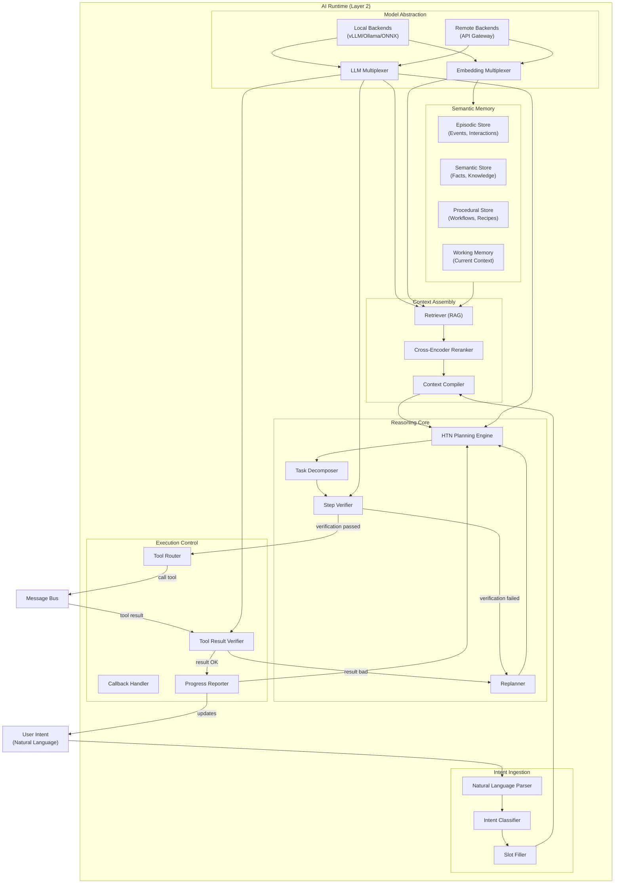
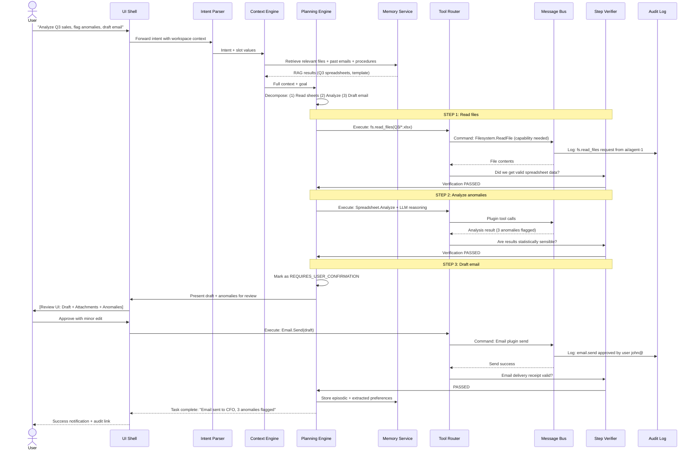
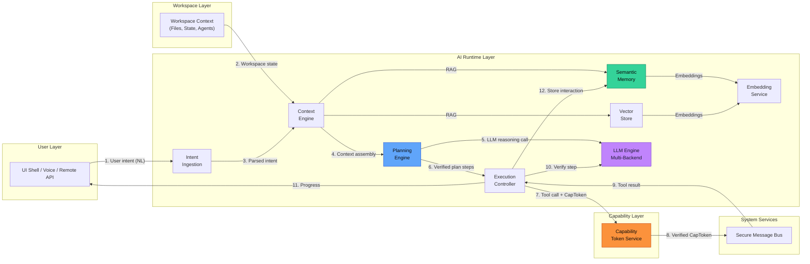

# CognyxOS AI Architecture

> **Document ID:** ARCH-003
> **Version:** 1.0.0
> **Status:** Phase 0 - Approved
> **Last Updated:** 2026-08-01
> **Owner:** AI Runtime Team

---

## Table of Contents

1. [AI Runtime Architecture](#ai-runtime-architecture)
2. [LLM Engine](#llm-engine)
3. [Planning Engine](#planning-engine)
4. [Semantic Memory System](#semantic-memory-system)
5. [Context Engine](#context-engine)
6. [Embedding Service](#embedding-service)
7. [Vector Store](#vector-store)
8. [Agent Orchestrator](#agent-orchestrator)
9. [Task Execution Lifecycle](#task-execution-lifecycle)
10. [AI Runtime Diagram](#ai-runtime-diagram)
11. [AI Security & Safety](#ai-security--safety)

---

## AI Runtime Architecture

The AI Runtime is the intelligent nucleus of CognyxOS. It transforms user intent expressed in natural language into concrete, verified system actions. Unlike traditional OSes where the kernel orchestrates hardware, the AI Runtime orchestrates **capabilities**—composing tools, services, and applications toward goal achievement.

### Core Principles

1. **Reasoning is Observable:** Every AI decision, plan step, and tool call has a traceable, explainable provenance record.
2. **Graceful Degradation:** If AI features fail, the system falls back to explicit user interaction—never silently produces incorrect output.
3. **Human-in-the-Loop Defaults:** Destructive, privacy-sensitive, or security-critical actions always require explicit user confirmation before execution.
4. **Local-First Inference:** Default models run locally. Cloud inference is an opt-in capability, never required.
5. **Bias Toward Action Verification:** Every tool result is verified before proceeding to the next plan step. Failed verifications trigger replanning.

### Subsystem Topology



---

## LLM Engine

**Purpose:** Provide language model inference with multi-backend abstraction, intelligent routing, and performance optimization.

### Backend Support Matrix

| Backend | Model Format | Quantization | CUDA | CPU | Metal | ROCm | Use Case |
|---------|-------------|--------------|------|-----|-------|------|----------|
| **vLLM** | PyTorch, GGUF, GPTQ, AWQ | Q4, Q5, Q8, FP16 | ✅ | ❌ | ❌ | ✅ | High-throughput local GPU inference |
| **Ollama** | GGUF | Q2, Q3, Q4, Q5, Q6, Q8, FP16 | ✅ | ✅ | ✅ | ✅ | Ease of use, cross-platform |
| **ONNX Runtime** | ONNX | Q4, Q8, FP16, FP32 | ✅ | ✅ | ✅ | ✅ | CPU fallback, edge devices |
| **OpenAI API** | Remote API | N/A | Cloud | Cloud | Cloud | Cloud | Opt-in cloud fallback |
| **Anthropic API** | Remote API | N/A | Cloud | Cloud | Cloud | Cloud | Opt-in cloud fallback |
| **Gemini API** | Remote API | N/A | Cloud | Cloud | Cloud | Cloud | Opt-in cloud fallback |

### LLM Routing Logic

```
RouteRequest {
  required_capability: REASONING | CODE | CREATIVE | SUMMARIZATION | FUNCTION_CALLING
  minimum_context_tokens: u32
  maximum_latency_ms: u32
  sensitivity_level: INTERNAL | PERSONAL | CONFIDENTIAL | TOP_SECRET
  task_id: Uuid
  workspace_id: Uuid
}

Routing Decision Algorithm:
  1. Filter backends by sensitivity (TOP_SECRET = local only, CONFIDENTIAL = local preferred)
  2. Filter by context window size >= minimum_context_tokens
  3. Score remaining by (latency_p95 <= maximum_latency_ms) + (benchmark_score for required_capability)
  4. If GPU available and memory sufficient: prefer GPU-accelerated backend
  5. Fallback chain: vLLM → Ollama → ONNX → Remote API (if sensitivity allows)
```

### Public APIs

```protobuf
service LLMService {
  rpc Generate(GenerateRequest) returns (GenerateResponse);
  rpc GenerateStream(GenerateRequest) returns (stream TokenResponse);
  rpc Chat(ChatRequest) returns (ChatResponse);
  rpc ChatStream(ChatRequest) returns (stream ChatDelta);
  rpc BatchGenerate(BatchGenerateRequest) returns (BatchGenerateResponse);
  rpc Embed(EmbedRequest) returns (EmbedResponse);
  rpc ListModels(ListModelsRequest) returns (ListModelsResponse);
  rpc GetModelInfo(ModelInfoRequest) returns (ModelInfo);
  rpc LoadModel(LoadModelRequest) returns (LoadResult);
  rpc UnloadModel(UnloadRequest) returns (google.protobuf.Empty);
  rpc GetRoutingDecision(RouteRequest) returns (RouteDecision);
}
```

---

## Planning Engine

**Purpose:** Decompose high-level user intent into verified, executable action sequences.

### Planning Paradigm: Hierarchical Task Networks (HTN)

The planner operates on a task hierarchy:

```
TaskNode {
  id: Uuid
  type: GOAL | COMPOUND | PRIMITIVE | VERIFICATION
  description: String
  preconditions: Vec<Proposition>
  subtasks: Vec<TaskNode>          // For COMPOUND
  method: Vec<Method>               // Alternative decompositions for COMPOUND
  primitive_action: PrimitiveAction // For PRIMITIVE
  verification_query: String        // For VERIFICATION
  estimated_cost: u32
  confidence: f32 (0-1)
  dependencies: Vec<Uuid>
}
```

### Planner Phases

1. **Phase 1: Goal Formulation**
   - Parse user intent into goal predicates
   - Extract explicit and implicit constraints
   - Determine user authorization level

2. **Phase 2: Decomposition**
   - Recursively decompose compound tasks via methods
   - Expand until all leaves are primitive actions
   - Generate verification steps between every N primitive steps

3. **Phase 3: Precondition Checking**
   - Verify every primitive has its preconditions met
   - Determine missing capabilities; flag for user approval

4. **Phase 4: Critical Point Flagging**
   - Identify destructive, security-sensitive, privacy-sensitive steps
   - Mark these as REQUIRES_USER_CONFIRMATION

5. **Phase 5: Execution**
   - Execute primitives in dependency order
   - Run verification steps; fail and replan if not verified
   - Report progress incrementally

### Public APIs

```protobuf
service PlanningService {
  rpc CreatePlan(PlanRequest) returns (Plan);
  rpc ExecutePlan(ExecutePlanRequest) returns (PlanExecutionHandle);
  rpc CancelPlan(CancelRequest) returns (google.protobuf.Empty);
  rpc PausePlan(PauseRequest) returns (google.protobuf.Empty);
  rpc ResumePlan(ResumeRequest) returns (google.protobuf.Empty);
  rpc GetPlanStatus(StatusRequest) returns (PlanStatus);
  rpc VerifyStep(VerifyStepRequest) returns (StepVerification);
  rpc GetPlanHistory(HistoryRequest) returns (PlanExecutionHistory);
  rpc RegisterPlanningMethod(MethodRegistration) returns (MethodId);
  rpc WatchPlanEvents(WatchRequest) returns (stream PlanEvent);
}
```

---

## Semantic Memory System

**Purpose:** Persistent, structured memory of user interactions, knowledge, and workflows.

### Three Memory Stores

#### Episodic Memory
Stores discrete events and interactions:
- User utterances and AI responses
- Plan executions (success, failure, why)
- Tool calls and their results
- Workspace context snapshots

```
EpisodicRecord {
  id: Uuid
  timestamp: Timestamp
  workspace_id: Uuid
  event_type: UTTERANCE | TOOL_CALL | PLAN_STEP | DECISION | NOTIFICATION
  actor: USER | AI_AGENT<id> | SYSTEM
  content: String
  content_embedding: Vec<f32>
  summary: String                    // Generated on store for retrieval
  summary_embedding: Vec<f32>
  related_ids: Vec<Uuid>             // Links to related episodic records
  importance_score: f32              // Decays over time, user actions boost
  metadata: HashMap<String, String>
}
```

#### Semantic Memory
Stores facts and knowledge about the user, their domains, and the world:
- User preferences and habits
- Project knowledge extracted from workspace files
- Learned relationships between concepts

```
SemanticTriple {
  id: Uuid
  subject: String
  predicate: String
  object: String
  confidence: f32
  source_episodic_id: Option<Uuid>
  workspace_id: Option<Uuid>
  scope: USER | WORKSPACE | GLOBAL
  embedding: Vec<f32>
  last_verified: Timestamp
}
```

#### Procedural Memory
Stores workflows, recipes, and reusable task decompositions:
- User-approved plan patterns
- Best-practice procedures for common tasks
- Domain-specific workflows extracted from documentation

```
Procedure {
  id: Uuid
  name: String
  description: String
  trigger_conditions: Vec<Proposition>    // When to suggest this procedure
  task_template: TaskNode                 // HTN template
  usage_count: u32
  success_rate: f32
  tags: Vec<String>
  author: IdentityId
  workspace_scope: Option<Uuid>
}
```

### Memory Lifecycle

1. **Acquisition:** Every AI interaction and plan step auto-stored to Episodic Memory
2. **Consolidation:** Nightly batch process extracts Semantic triples and procedural patterns from Episodic memory
3. **Forgetting:** TTL-based eviction of low-importance episodic records; active use boosts importance
4. **Retrieval:** Hybrid vector + keyword search at query time

### Public APIs

```protobuf
service MemoryService {
  rpc StoreEpisodic(StoreEpisodicRequest) returns (RecordId);
  rpc StoreSemantic(StoreSemanticRequest) returns (TripleId);
  rpc StoreProcedure(StoreProcedureRequest) returns (ProcedureId);
  rpc RetrieveEpisodic(RetrieveRequest) returns (stream EpisodicRecord);
  rpc RetrieveSemantic(SemanticQuery) returns (stream SemanticTriple);
  rpc RetrieveProcedure(ProcedureQuery) returns (stream Procedure);
  rpc HybridRetrieve(HybridQuery) returns (RetrievalResults);
  rpc Forget(ForgetRequest) returns (google.protobuf.Empty);
  rpc Consolidate(ConsolidateRequest) returns (ConsolidationReport);
  rpc GetMemoryStats(StatsRequest) returns (MemoryStats);
}
```

---

## Context Engine

**Purpose:** Assemble the optimal context window for each LLM inference request, balancing relevance, completeness, and token budget.

### Context Assembly Pipeline

```
Query + Token Budget
    │
    ▼
[1] Working Memory Snapshot
    ├── Current workspace state
    ├── Recent conversation history (last N turns)
    └── In-flight plan state
    │
    ▼
[2] Retrieval-Augmented Generation (RAG)
    ├── Episodic memory similarity search (k=50)
    ├── Semantic triple query (k=30)
    ├── File content search (k=50)
    └── Procedure match (k=10)
    │
    ▼
[3] Reranking
    └── Cross-encoder reranker on (query, candidate) pairs → top M by score
    │
    ▼
[4] Context Compilation
    ├── Assign token budget per category
    ├── Long context via hierarchical summarization if needed
    ├── Format into structured messages (System + User + Context sections)
    └── Validate token count ≤ budget
    │
    ▼
Context Package (delivered to LLM)
```

### Context Budget Allocation (Default)

| Category | Token Allocation % | Purpose |
|----------|-------------------|---------|
| System Prompt | 10% | AI persona, rules, safety constraints |
| Working Memory (recent) | 20% | Last 10 conversation turns, in-flight plan |
| Episodic Retrieval | 20% | Relevant past interactions |
| Semantic Retrieval | 15% | Facts, preferences, knowledge |
| File/Workspace Retrieval | 25% | Relevant files, code, docs |
| Procedures | 10% | Matching workflows/templates |

### Public APIs

```protobuf
service ContextEngine {
  rpc AssembleContext(AssembleRequest) returns (ContextPackage);
  rpc UpdateWorkingMemory(UpdateRequest) returns (google.protobuf.Empty);
  rpc GetWorkingMemory(WMRequest) returns (WorkingMemorySnapshot);
  rpc ClearWorkingMemory(ClearRequest) returns (google.protobuf.Empty);
  rpc IndexWorkspaceFiles(IndexRequest) returns (IndexResult);
  rpc SearchWorkspaceContext(SearchRequest) returns (ContextHits);
  rpc GetContextBudget(BudgetRequest) returns (ContextBudget);
}
```

---

## Embedding Service

**Purpose:** Generate vector embeddings for text, images, and audio for semantic search and memory retrieval.

### Model Support

| Model | Dimensions | Modality | Speed | Quality | Use Case |
|-------|-----------|----------|-------|---------|----------|
| all-MiniLM-L6-v2 | 384 | Text | Very Fast | Good | General purpose, edge |
| bge-large-en-v1.5 | 1024 | Text | Medium | Excellent | High-quality retrieval |
| multilingual-e5-large | 1024 | Multilingual Text | Medium | Excellent | Multilingual workspace |
| CLIP ViT-L/14 | 768 | Text + Image | Medium | Good | Image + text search |
| AudioCLIP | 1024 | Audio | Slow | Good | Audio indexing |

### Service Guarantees

- **Async Batch:** Embeddings batched for throughput; latency 50-200ms p99
- **Caching:** LRU + semantic similarity cache, 80% hit rate target
- **Dim Normalization:** All embeddings L2 normalized for cosine similarity
- **Determinism:** Same input always produces same embedding (within model determinism)

### Public APIs

```protobuf
service EmbeddingService {
  rpc EmbedText(EmbedTextRequest) returns (TextEmbedding);
  rpc EmbedTextBatch(EmbedBatchRequest) returns (BatchEmbedding);
  rpc EmbedImage(EmbedImageRequest) returns (ImageEmbedding);
  rpc EmbedAudio(EmbedAudioRequest) returns (AudioEmbedding);
  rpc EmbedMultimodal(MultimodalRequest) returns (MultimodalEmbedding);
  rpc GetSupportedModels(ModelsRequest) returns (SupportedModels);
  rpc WarmModelCache(WarmRequest) returns (google.protobuf.Empty);
}
```

---

## Vector Store

**Purpose:** Persistent, indexed vector database for semantic similarity search.

### Architecture (Qdrant-Based)

```
Qdrant Cluster (local single-node, distributed multi-node future)
├── Collection: episodic_memory_{workspace_id}
│   ├── Vector: 1024-dim (bge-large)
│   ├── Payload: timestamp, event_type, workspace_id, metadata
│   └── Index: HNSW + Quantization (Scalar Q4)
├── Collection: semantic_triples_{workspace_id}
│   ├── Vector: 1024-dim
│   ├── Payload: subject, predicate, object, confidence
│   └── Index: HNSW + Quantization (Scalar Q4)
├── Collection: files_{workspace_id}
│   ├── Vector: 1024-dim
│   ├── Payload: file_path, chunk_id, file_type, modified_at
│   └── Index: HNSW + Quantization (Scalar Q4)
└── Collection: procedures_global
    ├── Vector: 1024-dim
    ├── Payload: procedure_id, tags, scope
    └── Index: HNSW + Quantization (Scalar Q4)
```

### Collection Isolation

- Every workspace gets its own collections
- Cross-workspace queries require explicit capability token
- Global collections (procedures_global) only writable by system

### Performance Targets

| Metric | Target |
|--------|--------|
| Ingest throughput | 10k vectors/sec (local) |
| Query latency p95 | < 50ms (top-k=20, 1M vectors) |
| Recall@10 | > 95% (vs brute-force) |
| Storage overhead | < 1.5x raw vector size (with quantization) |

---

## Agent Orchestrator

**Purpose:** Manage the lifecycle, delegation, and communication of AI agents.

### Agent Taxonomy

```
AgentIdentity {
  id: AgentId
  type: SYSTEM_BUILTIN      // Pre-shipped by CognyxOS (cannot be disabled)
        | USER_INSTALLED    // Installed by user from marketplace
        | WORKSPACE_LOCAL   // Defined within a single workspace
        | REMOTE_FEDERATED  // Runs on remote CognyxOS instance
  capability_bounds: Vec<CapabilityId>  // Max authority
  execution_model: PROCESS   // Runs in own process (stronger isolation)
                 | WASM      // Runs in Wasm sandbox (lightweight)
                 | REMOTE    // Runs elsewhere, IPC over bus
}
```

### Agent Communication Protocol

```
AgentMessage {
  id: Uuid
  from: AgentId | USER
  to: AgentId | BROADCAST | WORKSPACE_ALL
  type: TASK_DELEGATION | QUERY | RESPONSE | NOTIFICATION | STATUS
  correlation_id: Uuid
  capability: CapabilityToken
  payload: TaskRequest | Query | TaskResult | etc.
  deadline: Timestamp
  signature: Ed25519
}
```

### Delegation Rules

1. An agent may only delegate capabilities it itself possesses
2. Delegated tokens have `delegation_allowed = false` by default (no sub-delegation unless explicitly granted)
3. All agent actions generate audit log entries
4. User-agent communication is always end-to-end encrypted with session key

### Public APIs

```protobuf
service AgentOrchestrator {
  rpc SpawnAgent(SpawnAgentRequest) returns (AgentHandle);
  rpc TerminateAgent(TerminateRequest) returns (google.protobuf.Empty);
  rpc SendMessage(AgentMessage) returns (SendReceipt);
  rpc QueryAgent(AgentQuery) returns (AgentResponse);
  rpc ListAgents(ListRequest) returns (ListAgentsResponse);
  rpc GetAgentInfo(AgentId) returns (AgentInfo);
  rpc DelegateCapability(DelegateRequest) returns (CapabilityToken);
  rpc RegisterAgent(AgentRegistration) returns (AgentManifestId);
  rpc WatchAgentEvents(WatchRequest) returns (stream AgentEvent);
}
```

---

## Task Execution Lifecycle



---

## AI Runtime Diagram



---

## AI Security & Safety

### Three-Layer Safety Model

#### Layer 1: Pre-Execution Constraints
- **System Prompt Injection Defense:** Separate context segments with explicit delimiters; adversarial input detection classifier
- **Authorization Pre-Check:** Every tool call capability-checked before execution
- **Harm Classification:** Classifier detects intent to cause harm before planning starts

#### Layer 2: In-Execution Guardrails
- **Human-in-the-Loop (HITL) Triggers:** Destructive file ops, outbound email, system config changes, credential use → pause for user confirmation
- **Sandbox Isolation:** AI agent processes run with minimal capabilities; tool calls mediated over bus
- **Budget Enforcement:** Token, time, and tool-call budgets per plan; exhaustion forces user confirmation

#### Layer 3: Post-Execution Review
- **Automatic Post-Mortem:** Completed plans analyzed for safety issues; anomalies flagged
- **User Feedback Loop:** Overrides and corrections stored in memory for future preference learning
- **Audit Trail:** Every AI decision and action is traceable to an exact chain of reasoning

### Bias Mitigation

- **Local Model Auditing:** Pre-shipped models evaluated on CognyxOS bias benchmark suite before release
- **No Autonomous High-Stakes Decisions:** Financial, legal, medical, HR-relevant outputs always flagged for human review
- **Transparency Reports:** Annual AI safety and bias audit reports published publicly
