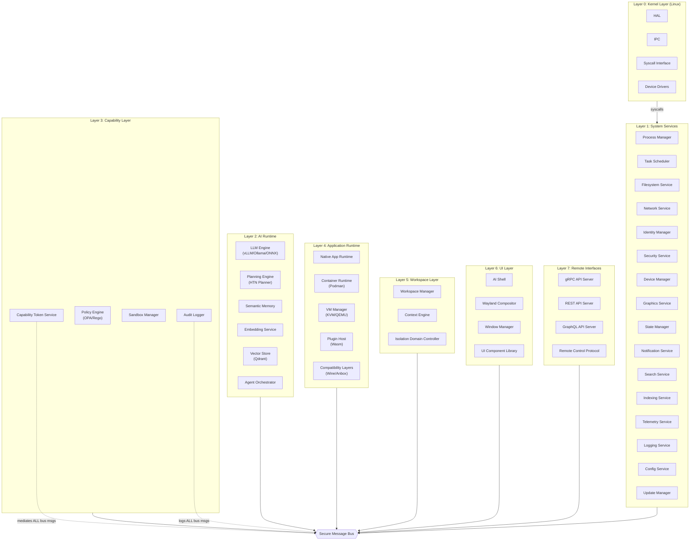
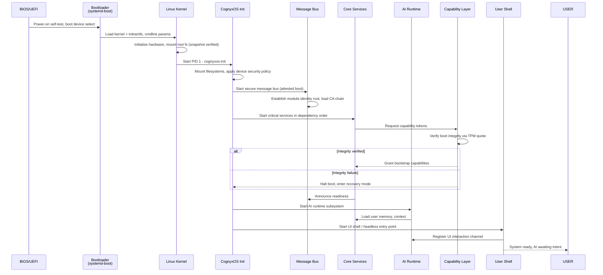
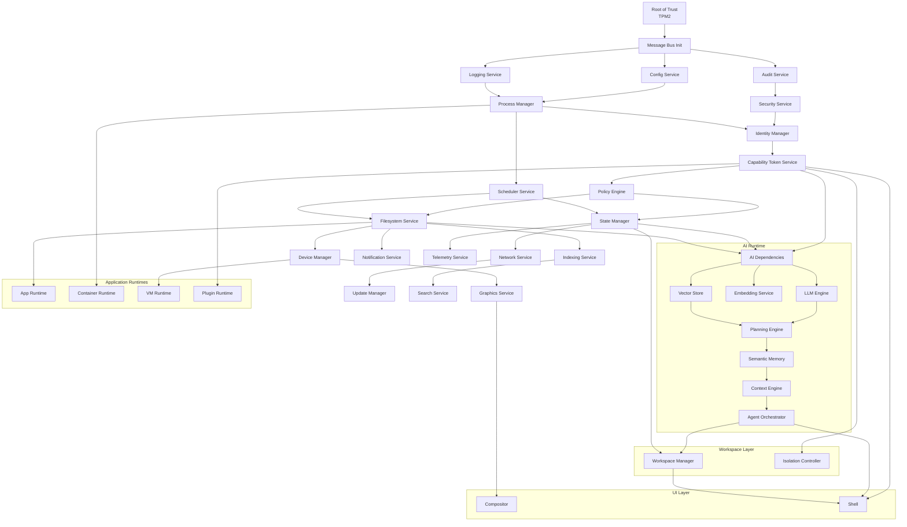

# CognyxOS Architecture

> **Document ID:** ARCH-001
> **Version:** 1.0.0
> **Status:** Phase 0 - Approved
> **Last Updated:** 2026-08-01
> **Owner:** Architecture Council

---

## Table of Contents

1. [Architectural Overview](#architectural-overview)
2. [Layered Architecture](#layered-architecture)
3. [Module Communication Model](#module-communication-model)
4. [Overall Architecture Diagram](#overall-architecture-diagram)
5. [Boot Flow Architecture](#boot-flow-architecture)
6. [Module Dependency Graph](#module-dependency-graph)
7. [Fault Tolerance Architecture](#fault-tolerance-architecture)
8. [Scalability Architecture](#scalability-architecture)
9. [Architectural Decision Records (ADRs)](#architectural-decision-records)

---

## Architectural Overview

CognyxOS implements a **seven-layered, message-passing, capability-secure** architecture. Each layer is strictly separated; no layer may communicate directly with layers more than one hop away, except through explicit message routing.

```
┌──────────────────────────────────────────────────────────────┐
│  Layer 7: Remote Interfaces                                   │
│  (gRPC, REST, GraphQL, Remote Control API)                   │
├──────────────────────────────────────────────────────────────┤
│  Layer 6: UI Layer                                            │
│  (Shell, Compositor, Window System, Components)              │
├──────────────────────────────────────────────────────────────┤
│  Layer 5: Workspace Layer                                     │
│  (Workspace Manager, Context Engine, Isolation Domains)      │
├──────────────────────────────────────────────────────────────┤
│  Layer 4: Application Runtime                                 │
│  (App Runtime, Container Runtime, VM Manager, Plugin Host)   │
├──────────────────────────────────────────────────────────────┤
│  Layer 3: Capability Layer                                    │
│  (Permission Manager, Capability Tokens, Policy Engine)      │
├──────────────────────────────────────────────────────────────┤
│  Layer 2: AI Runtime                                          │
│  (LLM Engine, Planning, Memory, Embeddings, Vector DB)       │
├──────────────────────────────────────────────────────────────┤
│  Layer 1: System Services                                     │
│  (Process, Scheduler, FS, Network, Identity, Device, etc.)   │
├──────────────────────────────────────────────────────────────┤
│  Layer 0: Kernel Layer                                        │
│  (Linux HAL, IPC, Syscall Interface, Device Drivers)         │
└──────────────────────────────────────────────────────────────┘
```

### Design Constraints

1. **Every inter-module communication** must traverse the Message Bus
2. **Every capability grant** must pass through the Capability Layer
3. **Every user interaction** must flow through the AI Runtime (or explicitly opt out)
4. **Every state mutation** must be logged to the audit trail
5. **Every subsystem** must implement the `ModuleLifecycle` interface

---

## Layered Architecture

### Layer 0: Kernel Layer

**Purpose:** Hardware abstraction and minimal process isolation primitives. This is Linux. We do not build a kernel; we build on top of it.

**Components:**
- **HAL (Hardware Abstraction Layer):** Device enumeration, power management, interrupt routing abstraction
- **IPC Subsystem:** Low-level Unix domain sockets, shared memory channels, memfd for zero-copy bulk transfer
- **Syscall Interface:** Filtered syscall interface via seccomp-bpf, exposed to sandboxes
- **Device Drivers:** Kernel modules for GPU, storage, networking, human interface devices

**Key Interfaces:**
```
HalDevice { enumerate(), bind(), unbind(), power_state() }
IpcChannel { send(), recv(), poll(), close() }
SyscallPolicy { filter(), allow(), deny() }
```

### Layer 1: System Services

**Purpose:** Microservices that provide OS primitives. Each service runs in its own process sandbox, owns its state, and communicates exclusively via the message bus.

**Core Services (21 total):**

| Service | Purpose | Criticality |
|---------|---------|-------------|
| Process Manager | Process lifecycle, cgroups, namespaces, supervision | CRITICAL |
| Scheduler | Task prioritization, deadline management, resource scheduling | CRITICAL |
| Workspace Manager | Workspace lifecycle, isolation, state serialization | CRITICAL |
| Filesystem Service | Virtual filesystem, overlay, snapshots, indexing hooks | CRITICAL |
| Network Service | Network stacks, VPN, firewall, proxy management | HIGH |
| Identity Manager | User identity, cryptographic keys, authentication | CRITICAL |
| Security Service | Audit, integrity measurement, attestation | CRITICAL |
| Device Manager | Hotplug, device permissions, driver binding | HIGH |
| Graphics Service | GPU scheduling, buffer management, display configuration | HIGH |
| State Manager | Global state reconciliation, CRDT sync, persistence | CRITICAL |
| Notification Service | User notifications, delivery, priority routing | MEDIUM |
| Search Service | Semantic search, full-text search, federated queries | MEDIUM |
| Indexing Service | File watcher, metadata extraction, embedding update | MEDIUM |
| Telemetry Service | Metrics collection, distribution, opt-in upload | LOW |
| Logging Service | Structured log aggregation, querying, rotation | HIGH |
| Config Service | Hierarchical config, defaults, user overrides, schema | HIGH |
| Update Manager | Atomic updates, rollback, delta patching, channel mgmt | HIGH |

### Layer 2: AI Runtime

**Purpose:** The reasoning core of the OS. All intelligent behavior originates here.

**Subsystems:**
- **LLM Engine:** Multi-backend inference (local Ollama/vLLM, remote APIs, ONNX fallback)
- **Planning Engine:** Hierarchical Task Network (HTN) planner with decomposition, verification, and replanning
- **Semantic Memory:** Long-term user memory with episodic, semantic, and procedural stores
- **Context Engine:** Real-time context assembly, retrieval-augmented generation (RAG), relevance ranking
- **Embedding Service:** Text/image/audio embedding generation, model multiplexing
- **Vector Store:** Qdrant-based vector database with per-workspace collections
- **Agent Orchestrator:** Agent lifecycle, delegation, inter-agent communication

### Layer 3: Capability Layer

**Purpose:** The security kernel. Mediates every cross-module interaction.

**Subsystems:**
- **Capability Token Service:** Mint, delegate, revoke, and verify unforgeable capability tokens
- **Policy Engine:** Rego/OPA-based policy evaluation for authorization decisions
- **Sandbox Manager:** Namespace, seccomp, cgroup configuration for process isolation
- **Audit Logger:** Cryptographically signed audit trail of every capability use

### Layer 4: Application Runtime

**Purpose:** Execute legacy and modern application workloads.

**Runtime Hosts:**
- **Native App Runtime:** CognyxOS-native capability-based applications
- **Container Runtime:** Podman-based OCI container execution with user namespace remapping
- **VM Manager:** libvirt/QEMU/KVM for full hardware virtualization (Windows, macOS guests)
- **Plugin Host:** WebAssembly (Wasm) sandbox for lightweight, capability-restricted plugins
- **Compatibility Layers:** Wine (Windows), Anbox (Android), Darling (macOS, future)

### Layer 5: Workspace Layer

**Purpose:** The unit of user context. Everything meaningful happens in a workspace.

**Concepts:**
- **Workspace:** An isolated domain containing files, memory, agents, tools, and UI state
- **Workspace Context:** The AI's current situational awareness, assembled from workspace contents
- **Isolation Boundary:** Workspaces cannot share state except through explicit, user-authorized capability grants
- **Portability:** Workspaces are serializable, transmissible, and reproducible on other CognyxOS instances

### Layer 6: UI Layer

**Purpose:** Projection of OS state to human-perceivable form. Secondary to the AI interfaces.

**Components:**
- **Shell:** Primary user interaction surface (AI chat, workspace switcher, status)
- **Compositor:** Wayland-based rendering composition, effects, GPU acceleration
- **Window System:** Window management, tiling, workspaces, input routing
- **Component Library:** Shared React component library with accessibility guarantees

### Layer 7: Remote Interfaces

**Purpose:** Expose CognyxOS capabilities to remote clients.

**Protocols:**
- **gRPC API:** High-performance internal and trusted-client API
- **REST API:** Web-compatible CRUD interface for web clients
- **GraphQL API:** Flexible query interface for UI development
- **Remote Control Protocol:** Secure remote desktop/workspace control via WebRTC

---

## Module Communication Model

### Four Communication Patterns

Every inter-module interaction uses one of four patterns. No exceptions.

| Pattern | Interface | Use Case | Guarantees |
|---------|-----------|----------|------------|
| Command | `ICommandBus` | Request a state-changing action | Exactly-once delivery, ordered, cancellable |
| Query | `IRequestResponse` | Request a read | At-most-once, timeout, idempotent |
| Event | `IEventBus` | Announce a state change | At-least-once, ordered per stream |
| Stream | `IStreamingChannel` | Bulk/async data transfer | Backpressure, flow control, resumable |

### Message Lifecycle

```
Sender ──► Message Bus ──► Capability Check ──► Policy Eval ──► Receiver
                                 │                                   │
                                 │                                   ▼
                                 └───── Audit Log ◄──── Response / Error
```

### Message Format (Envelope)

```
MessageEnvelope {
  id: UUID v7
  type: COMMAND | QUERY | EVENT | STREAM_INIT | STREAM_DATA | STREAM_CLOSE
  timestamp: TAI64N
  sender: ModuleIdentity
  target: ModuleIdentity | BroadcastTopic
  capability: CapabilityToken (optional)
  correlation_id: UUID (for request/response correlation)
  causation_id: UUID (for traceability)
  priority: LOW | NORMAL | HIGH | CRITICAL
  deadline: Timestamp (optional)
  retry_policy: RetryPolicy (optional)
  signature: Ed25519 Signature of sender
  payload_size: uint64
  payload_encoding: PROTOBUF | JSON | FLATBUFFERS
  payload_checksum: SHA-256
}
```

---

## Overall Architecture Diagram



---

## Boot Flow Architecture

### Boot Stages



### Boot Integrity Guarantees

1. **Measured Boot:** Every component from firmware to user space extends TPM PCRs
2. **Verified Boot:** dm-verity protects root filesystem; modifications require user consent
3. **Secure Boot:** Shim + kernel signed with user-controlled keys (Microsoft key optional)
4. **Deterministic Init:** systemd unit ordering + explicit service dependency graph

---

## Module Dependency Graph

Critical-path dependency resolution order (starting from root):



**Dependency Rules:**
- No circular dependencies allowed in the critical path
- Services may only depend on services with equal or higher criticality
- AI Runtime depends on *no* application runtime
- UI Layer depends on Workspace Layer, never directly on System Services

---

## Fault Tolerance Architecture

### Failure Domains

| Domain | Isolation Unit | Failure Impact | Recovery Strategy |
|--------|---------------|----------------|-------------------|
| Plugin | Wasm Instance | Single plugin crash | Auto-restart up to N times, circuit breaker |
| Service | Process + cgroup | Single service down | Supervisor restart, state replay, failover |
| Workspace | Namespace + Cgroup | One workspace inaccessible | Kill, restore from snapshot, user alert |
| AI Runtime | Process Group | AI features degraded | Fallback LLM, reduced capability, UI notice |
| Message Bus | Critical Process | System-wide outage | Dual-redundant bus, hot failover, flush to disk |
| Kernel | OS | Full system halt | Watchdog reboot, journal recovery fsck |

### Supervisor Hierarchy

```
cognyxos-init (PID 1)
├── cognyxos-bus (supervised, restart: always)
│   ├── watchdog (monitors bus health)
├── cognyxos-supervisor
│   ├── service-process-manager (restart: on-failure, 5x)
│   ├── service-scheduler (restart: on-failure, 5x)
│   ├── service-filesystem (restart: on-failure, 3x)
│   ├── ... (all Layer 1 services)
├── cognyxos-ai-supervisor
│   ├── ai-runtime-llm (restart: on-failure, degrade after 3x)
│   ├── ai-runtime-planning (restart: on-failure, degrade after 3x)
│   ├── ai-runtime-vector (restart: on-failure, degrade after 3x)
├── cognyxos-ui-supervisor
│   ├── compositor-wayland (restart: on-failure)
│   ├── shell-react (restart: on-failure)
```

### State Recovery

1. **Write-Ahead Log (WAL):** All state mutations append to WAL before commit
2. **State Snapshotting:** Periodic incremental snapshots of all service state
3. **Crash Replay:** On restart, services replay WAL from last snapshot to recover state
4. **Consensus Protocol:** For distributed state (future cloud mode), Raft consensus with leader election

---

## Scalability Architecture

### Dimensions of Scalability

1. **Vertical Scale:** CPU core count, RAM, GPU memory → Scheduler + AI Engine automatically distribute load
2. **Horizontal Scale (Future):** Multiple CognyxOS instances clustered → shared workspaces, distributed AI inference
3. **Module Scale:** 1 service → 1000 services → Message Bus sharding, topic routing
4. **User Scale:** 1 user → 1M users → Identity federation, workspace quotas, rate limiting

### Key Scaling Mechanisms

| Mechanism | Implementation | Target |
|-----------|---------------|--------|
| Message Bus Sharding | Per-topic queue sharding across workers | 1M msgs/sec per node |
| Vector Store Clustering | Qdrant distributed mode + sharding | 1B vectors, sub-50ms queries |
| Scheduler Multicore | Work-stealing scheduler, NUMA-aware | 10K concurrent tasks |
| Workspace Cgroups | Per-workspace resource limits, burst quotas | 100 concurrent workspaces |
| AI Model Cache | LRU + semantic similarity cache | 80% inference cache hit rate |
| Connection Pooling | Service-to-service multiplexed streams | 10K concurrent channels |

---

## Architectural Decision Records (ADRs)

### ADR-001: Message-Passing Over Shared Memory

- **Decision:** All inter-module communication via message bus. No shared memory regions except explicitly-approved zero-copy bulk transfer channels (which still pass capability metadata via the bus).
- **Rationale:** Observability, security mediation, and distributed tracing require every interaction to pass through a mediation point. Performance gains from shared memory are negligible vs. the architectural cost.
- **Implications:** Zero-copy paths exist for payloads > 64KB via memfd + single-use capability tokens.

### ADR-002: Linux as the Kernel

- **Decision:** Use Linux exclusively as the hardware abstraction layer. No custom kernel development.
- **Rationale:** Device driver coverage, ecosystem maturity, and security primitives (namespaces, cgroups, seccomp, eBPF, LSM) are irreplaceable. Engineering effort is better invested in the AI and capability layers.
- **Implications:** Minimum kernel version 6.8 LTS. We maintain kernel patches for: syscall filters, IPC performance, and scheduler tuning.

### ADR-003: Rust for All Critical Paths

- **Decision:** All Layer 0, 1, 2, and 3 components are implemented in Rust, with no `unsafe` blocks permitted in production without formal safety proofs.
- **Rationale:** Memory safety, thread safety, and zero-cost abstractions are non-negotiable for the security and stability of the system.
- **Implications:** FFI wrappers only at the edges. Critical dependencies audited. `cargo-vet` for supply chain attestation.

### ADR-004: Protocol Buffers as Canonical Serialization

- **Decision:** All message payloads use Protocol Buffers v3 as the canonical encoding. JSON is only permitted for external-facing REST/GraphQL APIs.
- **Rationale:** Schema evolution, performance, cross-language support, and compatibility with gRPC tooling.
- **Implications:** All `.proto` files live in `/proto` and are the source of truth. Code generation happens at build time.

### ADR-005: Capability-Based Security Model

- **Decision:** Object-capability model with unforgeable tokens, ambient authority elimination. No ACLs in the core system.
- **Rationale:** AI-orchestrated systems delegate authority constantly. ACLs fail at delegation and result in confused deputy problems. Capabilities compose correctly.
- **Implications:** Every API accepts a capability token parameter. Token minting, delegation, and revocation are explicitly modeled operations.
