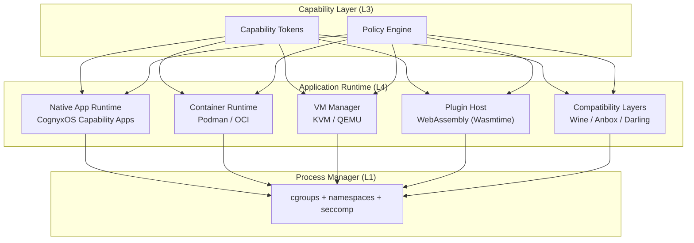
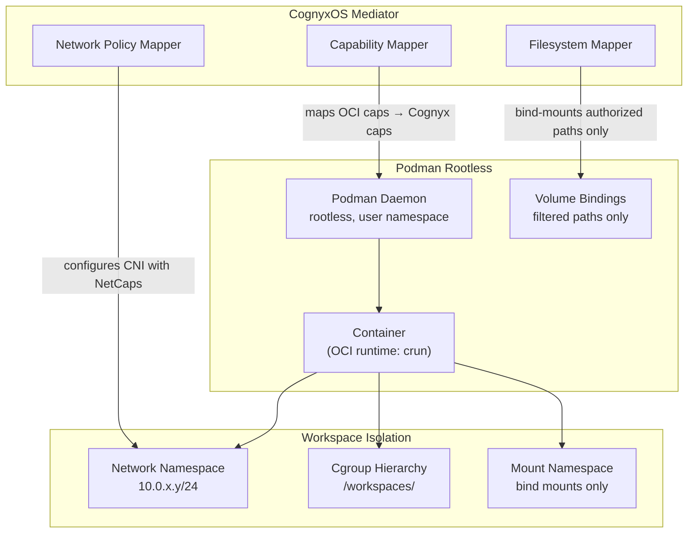
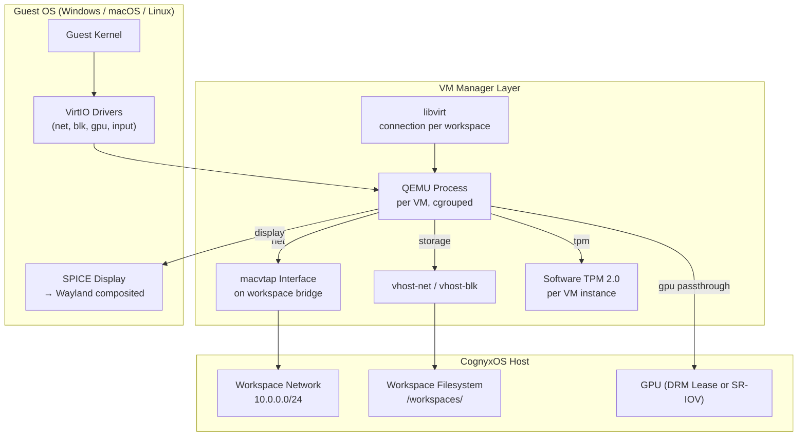
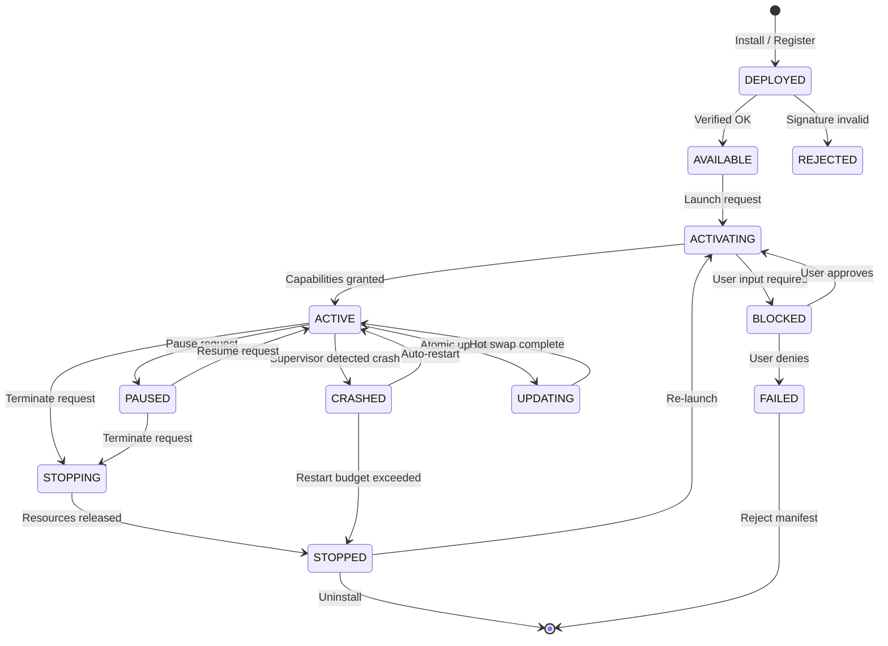
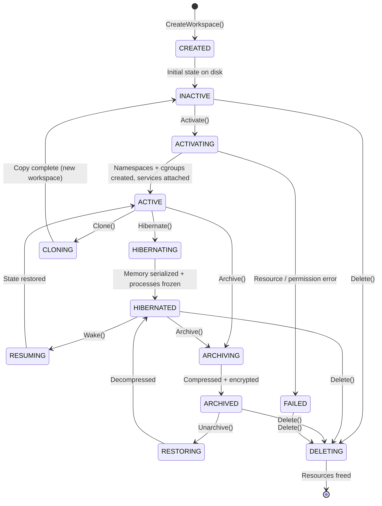
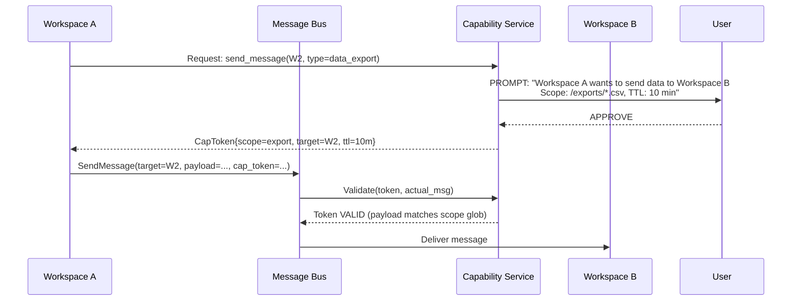

# CognyxOS Runtime Architecture

> **Document ID:** ARCH-004
> **Version:** 1.0.0
> **Status:** Phase 0 - Approved
> **Last Updated:** 2026-08-01
> **Owner:** Platform Runtime Team

---

## Table of Contents

1. [Runtime Overview](#runtime-overview)
2. [Native Application Runtime](#native-application-runtime)
3. [Container Runtime (Podman)](#container-runtime-podman)
4. [Virtual Machine Manager (KVM/QEMU)](#virtual-machine-manager-kvmqemu)
5. [Plugin Host (WebAssembly)](#plugin-host-webassembly)
6. [Compatibility Layers](#compatibility-layers)
7. [Application Lifecycle](#application-lifecycle)
8. [Workspace Isolation Architecture](#workspace-isolation-architecture)
9. [Runtime Security Model](#runtime-security-model)
10. [Runtime Interface Specifications](#runtime-interface-specifications)

---

## Runtime Overview

The Application Runtime Layer (Layer 4) is responsible for executing heterogeneous workloads under a unified capability-secure model. CognyxOS does not privilege native applications over containers, VMs, or plugins—all workloads are equal citizens mediated by the Capability Layer.

### Runtime Hosts



### Common Runtime Contract

All runtime hosts implement this interface:

```rust
trait RuntimeHost {
    fn start(&self, spec: WorkloadSpec) -> Result<WorkloadHandle>;
    fn stop(&self, handle: WorkloadHandle, timeout: Duration) -> Result<()>;
    fn pause(&self, handle: WorkloadHandle) -> Result<()>;
    fn resume(&self, handle: WorkloadHandle) -> Result<()>;
    fn status(&self, handle: WorkloadHandle) -> Result<WorkloadStatus>;
    fn snapshot(&self, handle: WorkloadHandle) -> Result<SnapshotId>;
    fn restore(&self, snapshot: SnapshotId) -> Result<WorkloadHandle>;
    fn grant_capability(&self, handle: WorkloadHandle, cap: CapabilityToken) -> Result<()>;
    fn revoke_capability(&self, handle: WorkloadHandle, cap_id: CapabilityId) -> Result<()>;
    fn watch_events(&self, filter: EventFilter) -> Pin<Box<dyn Stream<Item = WorkloadEvent>>>;
}
```

---

## Native Application Runtime

**Purpose:** Execute CognyxOS-native applications built against the capability-based SDK.

### App Model

CognyxOS-native apps are **not** traditional executables. They are capability bundles:

```
/app.bundle/
├── manifest.toml          # App identity, declared capabilities, entry points
├── binary/                # Native executable(s), signed
│   └── cognyx-app         # Entry point (Rust/TS via Tauri)
├── capabilities/          # Declared capability requirements
│   └── required.toml      # Minimum: filesystem read, window, notification...
├── icons/                 # App icons (multiple sizes, SVG preferred)
├── schemas/               # Message schemas (.proto files)
├── locale/                # i18n translations
└── signature.sig          # Ed25519 signature of bundle hash
```

### Manifest Example

```toml
[app]
id = "com.cognyx.calculator"
name = "Calculator"
version = "1.4.2"
min_os_version = "0.3.0"
entry_point = "binary/cognyx-app"

[capabilities.required]
"window.create" = { count = 1, properties = { size = "400x500", title = "Calculator" } }
"filesystem.read" = { paths = ["data/*.csv"], workspace_scope = true }

[capabilities.optional]
"filesystem.write" = { paths = ["exports/*.csv"], workspace_scope = true }
"network.outbound" = { hosts = ["api.exchangerate.example"], delegation = false }

[entry_points]
main = { command = "binary/cognyx-app", args = [] }
headless = { command = "binary/cognyx-app", args = ["--headless", "--serve-rpc"] }

[resources]
memory_limit_mb = 256
cpu_weight = 10
gpu_required = false
```

### App Launch Flow

```
1. User/AI requests: LaunchApp(com.cognyx.calculator, workspace_id)
2. Capability Layer: Validate app signature against trust root
3. Capability Layer: Check user has authority over declared capabilities
4. Capability Layer: Mint capability tokens (only required ones by default; optional = user approval)
5. Process Manager: Create process with cgroup limits + namespaces
6. Native Runtime: Inject capability tokens via env + socket pair
7. App connects to Message Bus via socket with its identity
8. First bus message: capabilities verified; app is "live"
9. UI Layer: Create window if app declared window capability
```

---

## Container Runtime (Podman)

**Purpose:** Run OCI-compliant containers under CognyxOS capability model and workspace isolation.

### Architecture



### Key Security Choices

- **Rootless Everywhere:** Podman always runs rootless. No exceptions. `--privileged` is disallowed.
- **User Namespace Remapping:** Container UID 0 maps to non-privileged host UID range.
- **Seccomp Inheritance:** Container seccomp profile is the union of: default Podman profile + workspace restrictions + explicit deny list.
- **Network Capabilities:** Containers start with NO network access. Network capabilities must be explicitly granted.
- **Bind-Mount Filtering:** Only paths within the workspace directory may be bind-mounted; escape attempts rejected.

### Container Lifecycle API

```protobuf
service ContainerRuntime {
  rpc PullImage(PullImageRequest) returns (stream PullProgress);
  rpc CreateContainer(CreateContainerRequest) returns (ContainerHandle);
  rpc StartContainer(ContainerHandle) returns (StartResult);
  rpc StopContainer(StopRequest) returns (google.protobuf.Empty);
  rpc PauseContainer(ContainerHandle) returns (google.protobuf.Empty);
  rpc UnpauseContainer(ContainerHandle) returns (google.protobuf.Empty);
  rpc DeleteContainer(ContainerHandle) returns (google.protobuf.Empty);
  rpc GetContainerStatus(ContainerHandle) returns (ContainerStatus);
  rpc ExecInContainer(ExecRequest) returns (ExecHandle);
  rpc ListContainers(ListRequest) returns (ListContainersResponse);
  rpc GetContainerLogs(LogRequest) returns (stream LogLine);
  rpc MapCapability(CapMappingRequest) returns (CapabilityToken);
  rpc WatchContainerEvents(WatchRequest) returns (stream ContainerEvent);
}
```

---

## Virtual Machine Manager (KVM/QEMU)

**Purpose:** Full hardware virtualization for running Windows, macOS, and other guest OSes.

### Architecture (libvirt + QEMU/KVM)



### GPU Assignment Modes

| Mode | Use Case | Performance | Isolation |
|------|----------|-------------|-----------|
| **VirtIO-GPU (VirGL)** | Desktop UI, office apps | Good | Excellent |
| **DRM Lease Subset** | Gaming, 3D, GPU compute | Very Good | Good |
| **SR-IOV VF** | Enterprise, multi-VM GPU | Excellent | Excellent (HW) |
| **Full PCI Passthrough** | Maximum performance, CUDA | Native | Perfect (IOMMU) |

### VM Lifecycle API

```protobuf
service VmManager {
  rpc CreateVm(CreateVmRequest) returns (VmHandle);
  rpc StartVm(VmHandle) returns (StartResult);
  rpc StopVm(StopRequest) returns (google.protobuf.Empty);
  rpc PauseVm(VmHandle) returns (google.protobuf.Empty);
  rpc ResumeVm(VmHandle) returns (google.protobuf.Empty);
  rpc DeleteVm(VmHandle) returns (google.protobuf.Empty);
  rpc SnapshotVm(SnapshotRequest) returns (SnapshotId);
  rpc RestoreVm(RestoreRequest) returns (VmHandle);
  rpc CloneVm(CloneRequest) returns (VmHandle);
  rpc GetVmStatus(VmHandle) returns (VmStatus);
  rpc ConnectDisplay(DisplayRequest) returns (DisplayStream);
  rpc AttachDevice(AttachRequest) returns (google.protobuf.Empty);
  rpc DetachDevice(DetachRequest) returns (google.protobuf.Empty);
  rpc ConfigureGpuAssignment(GpuConfig) returns (google.protobuf.Empty);
  rpc ListVms(ListRequest) returns (ListVmsResponse);
  rpc WatchVmEvents(WatchRequest) returns (stream VmEvent);
}
```

---

## Plugin Host (WebAssembly)

**Purpose:** Lightweight, capability-restricted extensions. Wasm plugins are the preferred extension mechanism for non-resource-intensive use cases.

### Why Wasm?

1. **Deterministic Execution:** Bytecode identical across platforms
2. **Fine-Grained Sandbox:** Memory-safe, no undefined behavior escape, linear memory bounded
3. **Performance:** Near-native (within ~10% of compiled C)
4. **Language Agnostic:** Rust, C/C++, Zig, Go, TypeScript all compile to Wasm
5. **Start Speed:** Microseconds to instantiate

### Host Functions (WASI + Cognyx Extensions)

Plugins receive **only** the WASI preview 2 interfaces for capabilities they are granted, plus Cognyx-specific host functions for message bus access:

```wit
package cognyx:plugin;

interface message-bus {
  send-command: func(target: string, payload: list<u8>, caps: list<cap-token>) -> result<message-id, error>;
  subscribe-event: func(topic: string) -> result<event-stream, error>;
  send-query: func(target: string, payload: list<u8>) -> result<list<u8>, error>;
}

interface filesystem {
  open-file: func(cap: file-cap, path: string, mode: open-mode) -> result<fd, error>;
  read-file: func(fd: fd, len: u64) -> result<list<u8>, error>;
  write-file: func(fd: fd, data: list<u8>) -> result<u64, error>;
}

world plugin {
  import wasi:clocks/monotonic-clock
  import wasi:random/random
  import message-bus
  import filesystem (if granted)
  export cognyx:plugin/metadata
  export cognyx:plugin/entry-point
}
```

### Plugin Lifecycle

```
LOAD → VALIDATE (signature + manifest) → SANDBOX (Wasm instance + granted caps only)
    → INSTANTIATE → START → RUNNING ⇄ PAUSED → STOP → UNLOAD
```

---

## Compatibility Layers

### Windows Applications (Wine)

- Runs within a container runtime layer
- CognyxOS mediates all filesystem calls through FileCapability tokens
- Wayland output via Wine's Wayland driver (no X11 required)
- Registry and app data stored in workspace filesystem tree

### Android Applications (Anbox / Waydroid)

- LXC container running Android userspace
- Binder IPC filtered by capability layer
- Android app permissions mapped to CognyxOS capabilities
- Single-window or multi-window output via Wayland

### macOS Applications (Darling, Future)

- Full Cocoa runtime translation (long-term aspirational)
- macOS frameworks mapped to Linux equivalents
- Capability mediation at syscall boundary

---

## Application Lifecycle



### Workspace Lifecycle



---

## Workspace Isolation Architecture

### Isolation Primitives Per Workspace

```
Workspace Isolation Domain
├── Process Namespace   [PID_NS]    No process visibility outside workspace
├── Mount Namespace     [MNT_NS]    Only workspace root + bind mounts visible
├── Network Namespace   [NET_NS]    Isolated network stack, virtual ethernet
├── UTS Namespace       [UTS_NS]    Separate hostname
├── IPC Namespace       [IPC_NS]    No shared SysV IPC
├── User Namespace      [USER_NS]   UID/GID mapping; root in workspace != host root
├── Cgroup V2           [CGROUP]    CPU, memory, IO, PID limits per workspace
├── Seccomp Profile     [SECCOMP]   Filtered syscalls; workspace-specific allow list
├── LSM Policy          [LSM]       AppArmor / BPF-LSM; fine-grained path/network rules
└── Capability Set      [CAPS]      Zero ambient capabilities; all authority via tokens
```

### Cross-Workspace Communication

Workspaces are **strictly isolated** by default. Communication requires:
1. **Explicit user authorization** (graphical prompt with capability preview)
2. **Capability token minted** by Capability Token Service (limited scope, TTL, delegation false)
3. **Message bus routing** validates tokens and drops unauthorized inter-workspace messages



---

## Runtime Security Model

### Defense in Depth for a Workload

```
┌─────────────────────────────────────────────────────┐  Layer 7: Compatibility Layers (syscall emulation traps)
├─────────────────────────────────────────────────────┤  Layer 6: Wasm Sandbox / Container Runtime / VM
├─────────────────────────────────────────────────────┤  Layer 5: Seccomp-bpf Syscall Filter
├─────────────────────────────────────────────────────┤  Layer 4: Linux Security Module (BPF-LSM / AppArmor)
├─────────────────────────────────────────────────────┤  Layer 3: Namespace Isolation (PID, MNT, NET, UTS, IPC, USER)
├─────────────────────────────────────────────────────┤  Layer 2: Cgroup v2 Resource Limits (CPU, MEM, IO, PIDs)
├─────────────────────────────────────────────────────┤  Layer 1: CognyxOS Capability Token Mediation (Message Bus)
├─────────────────────────────────────────────────────┤  Layer 0: Kernel + Hardware (SMAP/SMEP, IOMMU, TPM)
└─────────────────────────────────────────────────────┘
```

### Ambient Authority Elimination

By the time any workload code executes:

- **Zero Linux capabilities:** `capsh --print` shows an empty capability set
- **Zero file descriptors inherited:** All FDs closed; only explicit passed FDs allowed
- **CWD set to workspace root:** No access to paths outside via relative traversal
- **No network routes:** Network namespace exists but no default route until NetCap granted
- **No device access:** `/dev` mount filtered; only `null`, `zero`, `urandom`, `random` present

---

## Runtime Interface Specifications

### `WorkloadSpec` (Common to All Runtimes)

```protobuf
message WorkloadSpec {
  Uuid workspace_id = 1;
  string workload_id = 2;
  string display_name = 3;
  RuntimeType runtime_type = 4;  // NATIVE | CONTAINER | VM | PLUGIN | COMPAT
  IdentityId owner = 5;

  ResourceLimits resources = 10;
  repeated CapabilityToken granted_capabilities = 11;
  repeated CapabilityId required_capability_ids = 12;

  oneof spec {
    NativeAppSpec native = 20;
    ContainerSpec container = 21;
    VmSpec vm = 22;
    PluginSpec plugin = 23;
    CompatAppSpec compat = 24;
  }

  RetryPolicy restart_policy = 30;
  google.protobuf.Duration startup_timeout = 31;
  google.protobuf.Duration shutdown_timeout = 32;

  map<string, string> metadata = 40;
}
```

### Runtime Type Matrix

| Feature | Native | Container | VM | Plugin |
|---------|--------|-----------|-----|--------|
| **Launch time** | < 50ms | < 1s | < 10s | < 1ms |
| **Memory overhead** | 1MB | ~50MB | ~512MB+ | 64KB |
| **Syscall access** | Filtered | Filtered+Namespaced | Emulated | None (host calls only) |
| **GPU access** | Full | Full (via CDI) | VirtIO/Passthrough | None (future) |
| **Run Windows** | No | No | Yes | No |
| **Run Linux apps** | Native Yes | Yes | Yes | No |
| **Security posture** | High | Very High | Excellent | Excellent |
| **Recommended for** | CognyxOS apps | Linux/Server apps | Windows/macOS | Extensions, tools, integrations |
