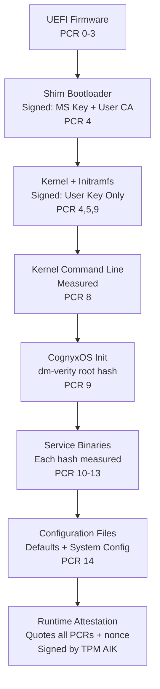
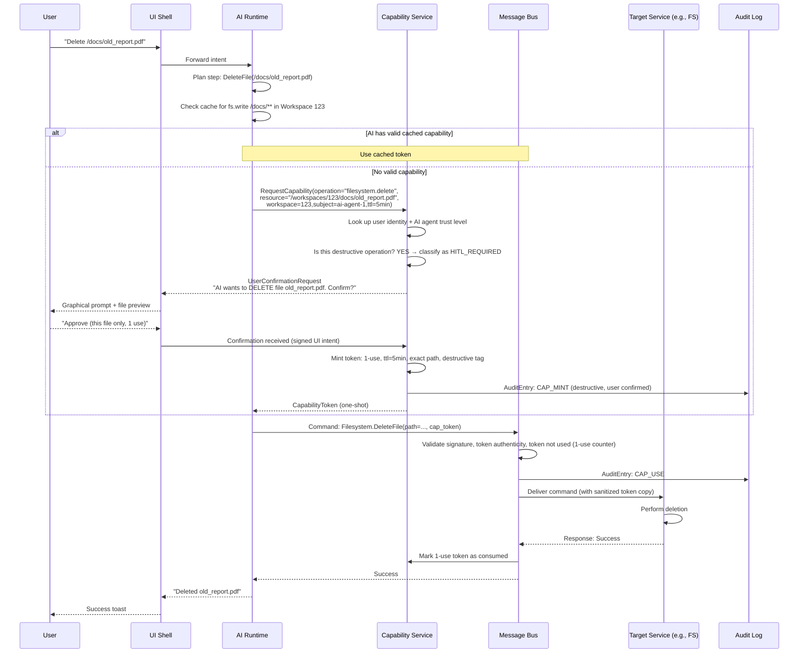

# CognyxOS Security Architecture

> **Document ID:** SEC-001
> **Version:** 1.0.0
> **Status:** Phase 0 - Approved
> **Last Updated:** 2026-08-01
> **Owner:** Security Architecture Team

---

## Table of Contents

1. [Security Philosophy](#security-philosophy)
2. [Zero-Trust Module Communication](#zero-trust-module-communication)
3. [Capability-Based Security Model](#capability-based-security-model)
4. [Sandbox Architecture](#sandbox-architecture)
5. [Agent Isolation](#agent-isolation)
6. [Container & VM Isolation](#container--vm-isolation)
7. [Plugin Verification](#plugin-verification)
8. [Permission Escalation Controls](#permission-escalation-controls)
9. [Audit Logging & Integrity](#audit-logging--integrity)
10. [Secure IPC](#secure-ipc)
11. [Cryptographic Architecture](#cryptographic-architecture)
12. [Trust Chain & Attestation](#trust-chain--attestation)
13. [Threat Model](#threat-model)
14. [Permission Flow Diagram](#permission-flow-diagram)

---

## Security Philosophy

CognyxOS is designed under the **principle of least authority at every layer, for every actor, at all times.**

Security is not a feature to be added—it is the skeleton upon which the entire system is built. No subsystem has privileged "backdoor" access to any other subsystem. The AI Runtime, the Message Bus, and even system services themselves operate under exactly the same capability-secure model as third-party plugins.

### Three Laws of CognyxOS Security

1. **Law of No Ambient Authority:** A module may do nothing except what its current capabilities explicitly permit. "Root" does not exist in the CognyxOS security model.
2. **Law of Explicit Delegation:** All authority is passed explicitly via unforgeable capability tokens. Authority is never implied by identity, group membership, or runtime position.
3. **Law of Audit Omniscience:** Every security-relevant event—every capability mint, every delegation, every use, every revocation—produces a cryptographically verifiable audit trail entry.

---

## Zero-Trust Module Communication

### Core Principle

Every module on the message bus is **untrusted by default.** Authentication, authorization, and integrity verification happen for every single message, at line rate, with no exceptions.

### Message Bus Security Checks (Per Message)

```
Message Received
    │
    ▼
[1] Sender Authentication
    ├── Module identity certificate validated against CA chain
    ├── Message signature (Ed25519) verified against identity key
    └── Replay protection: sequence number within window, timestamp within 5s
    │
    ▼
[2] Capability Token Validation
    ├── Token signature verified (cannot be forged)
    ├── Token not revoked (check revocation hash chain)
    ├── Token not expired (TTL validated)
    ├── Token scope includes target module + operation + payload
    └── Delegation chain valid (if delegated: each hop signed, delegation allowed)
    │
    ▼
[3] Policy Engine Evaluation
    ├── OPA/Rego policy loaded and hot-reloaded
    ├── Input: sender_identity, target_identity, operation, payload_hash, caps, workspace
    ├── Context: time-of-day, recent security events, risk_score(sender)
    └── Decision: ALLOW | DENY | REQUIRE_HITL | ESCALATE_AUTH
    │
    ▼
[4] Payload Scanning (If Enabled)
    ├── Malware pattern check (opt-in third-party scanner)
    ├── Data exfiltration pattern check (DLP rules)
    └── Structured payload schema validation
    │
    ▼
[5] Audit Logging
    └── Cryptographically signed entry appended to hash-chained audit log

    ▼
Deliver to Recipient
```

**Failure at any step → message dropped + security event emitted + (optionally) sender sandboxed.**

---

## Capability-Based Security Model

### Capability Token Format

```
CapabilityToken {
  version: u8 = 1
  token_id: Uuid
  type: OBJECT_CAPABILITY | ROLE_CAPABILITY | DELEGATION_CAPABILITY
  issuer: IdentityId
  subject: IdentityId | "*" (wildcard = bearer)
  operation: String (e.g., "filesystem.read", "process.spawn")
  resource_path: GlobPattern (e.g., "/workspaces/123/docs/**")
  constraints: {
    workspace_id: Option<Uuid>
    valid_from: Timestamp
    valid_until: Timestamp
    max_uses: Option<u64>
    delegation_depth: u8 (0 = no further delegation, max 3)
    rate_limit_ops_per_sec: Option<u32>
    payload_hash_allowlist: Option<Vec<Sha256>>
    user_confirmation_required: bool (human-in-the-loop)
  }
  delegation_chain: Vec<DelegationHop>
  signature: Ed25519Signature (over fields above)
}

DelegationHop {
  delegator: IdentityId
  new_subject: IdentityId
  new_constraints_delta: ConstraintsDelta (only reductions allowed)
  delegator_signature: Ed25519Signature
}
```

### Token Properties

| Property | Implementation |
|----------|---------------|
| **Unforgeable** | Ed25519 signature by issuer (Identity Manager root key) |
| **Tamper-proof** | Any field modification invalidates the signature |
| **Delegatable** | Subject may re-delegate, up to delegation_depth, with only reduced constraints |
| **Revocable** | Token added to revocation list; revocation hash-chained in audit log |
| **Expiring** | All tokens have TTL. Permanent tokens require explicit user action + recovery auth |
| **Non-transferable** | Tokens bound to subject identity; bearer tokens only in specific narrow use cases |

### Capability Lifecycle

```
MINT (Identity Manager signs token)
    → GRANT (Token delivered to subject process via secure FD passing)
    → USE (Subject attaches token to Message Bus messages)
    → VALIDATE (Bus checks every use)
    → REVOKE (On demand, or auto-expire)
    → EXPIRE (Automatic when valid_until passes)
```

### Common Capability Types (by namespace)

```
filesystem.{read,write,create,delete,chmod,acl}.{path_glob}
process.{spawn,kill,signal,ptrace}.{workspace_id}
network.{outbound,inbound,listen}.{cidr,port,proto}
device.{open,read,write,ioctl}.{device_path}
window.{create,resize,close,input}.{window_id_pattern}
workspace.{create,delete,hibernate,clone,share}.{workspace_id}
ai.{generate_text,generate_image,tool_use,memory_write}.{model_id}
config.{read,write,reset}.{config_key_glob}
notification.{send,dismiss,read}.{channel}
search.{query,index,remove}.{workspace_id}
```

---

## Sandbox Architecture

### Sandbox Composition Model

Every workload runs inside a **stacked sandbox**, with each layer adding independent security guarantees. A sandbox escape requires compromising all layers simultaneously.

```
┌──────────────────────────────────────────────────────────────────┐
│ Layer 7: WORKLOAD FILTERS                                        │
│ ├── Seccomp-bpf Syscall Filter (per-application allow list)      │
│ ├── Landlock / BPF-LSM (path-based filesystem restrictions)      │
│ └── Yama LSM (ptrace restrictions: no cross-process debug)       │
├──────────────────────────────────────────────────────────────────┤
│ Layer 6: NAMESPACE ISOLATION                                     │
│ ├── PID namespace (can't see host or other workspace PIDs)       │
│ ├── Mount namespace (workspace root only + bind mounts filtered) │
│ ├── Network namespace (isolated stack, veth pair to bridge)      │
│ ├── UTS namespace (separate hostname/domainname)                 │
│ ├── IPC namespace (no shared SysV semaphores/shmem)              │
│ └── User namespace (UID 0 inside → unprivileged UID outside)     │
├──────────────────────────────────────────────────────────────────┤
│ Layer 5: CGROUP V2 RESOURCE LIMITS                               │
│ ├── CPU controller (weight, max cores, quota per period)         │
│ ├── Memory controller (hard limit, soft limit, OOM score adj)    │
│ ├── IO controller (read/write BPS, IOPS per device major:minor)  │
│ ├── PID controller (max processes per sandbox)                   │
│ └── Devices controller (device whitelist: allow/deny list)       │
├──────────────────────────────────────────────────────────────────┤
│ Layer 4: CAPABILITY DROPPING                                     │
│ └── All Linux capabilities dropped. No CAP_SYS_* survives.       │
├──────────────────────────────────────────────────────────────────┤
│ Layer 3: COGNYXOS CAPABILITY MEDIATION                           │
│ └── All IPC, Filesystem, Network mediated via Message Bus caps   │
├──────────────────────────────────────────────────────────────────┤
│ Layer 2: HARDENED KERNEL                                         │
│ ├── Lockdown LSM (integrity mode → no unsigned module load)      │
│ ├── IOMMU-enabled (DMA restricted per device)                    │
│ ├── SMAP/SMEP/KPTI enabled (no kernel memory access from user)   │
│ └── Randomized VA layout, CFI, stack canaries                    │
├──────────────────────────────────────────────────────────────────┤
│ Layer 1: HARDWARE ROOT OF TRUST                                  │
│ └── TPM 2.0 + Secure Boot + Measured Boot PCR extension chain    │
└──────────────────────────────────────────────────────────────────┘
```

### Sandbox Policy Resolution

When launching a workload:

```rust
fn build_sandbox(spec: WorkloadSpec, ws: Workspace) -> Sandbox {
    // Start from MAXIMALLY RESTRICTIVE baseline
    let mut policy = SandboxPolicy::most_restrictive();

    // Additive only: add exactly the capabilities requested + verified
    for cap in spec.granted_capabilities {
        match cap.operation {
            "filesystem.read" => policy.allow_filesystem_read(cap.resource_path),
            "network.outbound" => policy.allow_network_outbound(cap.constraints.cidr),
            "device.open" => policy.allow_device(cap.resource_path),
            _ => return Err("Unknown capability in sandbox build"),
        }
    }

    // Baseline denials can NEVER be overridden
    policy.deny_all_syscalls_not_in_allowlist();
    policy.drop_all_linux_caps();
    policy.enforce_user_namespace();

    policy.build()
}
```

---

## Agent Isolation

### AI Agent Sandbox Profile

AI agents get an even more restrictive profile than native applications:

- **No default filesystem access** → must be granted per-path
- **No network access by default** → cloud model calls go through AI Runtime proxy (not direct)
- **No process spawning capability** → tools call via bus proxy only
- **Single-threaded concurrency limit** unless explicitly granted
- **Token budget per agent** → inference calls limited per plan/hour
- **All actions logged with provenance** → including intermediate reasoning traces

### Inter-Agent Communication Security

```
Agent A ──► Capability Service: RequestSendCap(Agent B, message_type)
    │
    ▼ User prompt (if first time)
    "Agent 'Research Helper' wants to send a message to Agent 'Email Composer'
     with scope 'document_fragments'. Allow? [Once / Always for this pair / Never]"
    │
    ▼
Capability Service mints SEND_CAP with exact scope
    │
    ▼
Agent A sends message to bus WITH cap token
    │
    ▼
Bus validates cap, AND validates payload hash against cap scope allowlist
    │
    ▼
Deliver to Agent B
```

---

## Container & VM Isolation

### Container Isolation Hardening (Podman)

- **Rootless always.** `--privileged` is **rejected unconditionally** in the CognyxOS patched Podman.
- **User namespace remapping:** container uid 0 → host uid range in 1,000,000-1,655,360 (no overlap with real users)
- **No-new-privileges flag set by default**
- **Seccomp profile hardened:** 300+ syscalls blocked by default; only ~80 allowed
- **Limit SECCOMP_RET_TRAP for dangerous calls:** mount, ptrace, kexec_load, etc. cause immediate SIGSYS
- **Image signature verification enforced:** unsigned images rejected; user must explicitly trust per-signing-key

### VM Isolation (libvirt/QEMU)

- **QEMU process runs as unprivileged user** per-VM unique UID
- **SELinux/AppArmor sVirt:** Mandatory Access Control labeling per-VM unique MCS label
- **NVRAM Secure Boot:** OVMF with secure boot enabled; only signed EFI binaries execute
- **TPM emulation:** Software TPM 2.0 (swtpm) per-VM with unique NVRAM; no cross-VM leakage
- **IOMMU protection:** PCI passthrough devices isolated via IOMMU groups; untrusted DMA rejected
- **Network:** Each VM on its own veth pair; firewall rules default-deny

---

## Plugin Verification

### Plugin Trust Model (WebAssembly Plugins)

```
Plugin Source
    │
    ▼
[1] Signature Verification
    ├── Ed25519 signature of plugin bundle checked
    ├── Key pinned to: (a) CognyxOS root, (b) developer key in user's trust store
    └── Unsigned plugins → require explicit "install unsigned" dangerous user action (3 confirmations)
    │
    ▼
[2] Memory Safety Audit (automatic static analysis)
    ├── Wasm bytecode validated for spec compliance
    ├── No undefined opcodes, no out-of-bounds segment refs
    ├── Import/export tables validated: only listed host functions imported
    └── Linear memory bounded; no memory.grow beyond declared max
    │
    ▼
[3] Capability Manifest Audit
    ├── Declared required vs optional capabilities
    ├── Host function imports MUST match declared capabilities; mismatch → REJECT
    ├── Dangerous capability combos flagged (e.g., fs.read_all + network.outbound_all)
    └── Conflicting with workspace policy → blocked
    │
    ▼
[4] Install-Time Sandbox Bake-In
    └── Wasm instance created with ONLY declared host functions linked; all others trap
```

### Supply Chain Attestation

- All plugins published to the official registry require:
  1. Reproducible build verification (deterministic Wasm byte output)
  2. Sigstore/Binary Transparency log inclusion (every version publicly logged)
  3. Provenance attestation (SLSA Level 3 minimum)

---

## Permission Escalation Controls

### Escalation Vectors & Mitigations

| Escalation Vector | Mitigation |
|-------------------|------------|
| **Capability delegation misuse** | Delegation depth max = 3. Reductions only (child can never have parent's unused authority). Delegation events are highest-priority audit entries. |
| **Linux capability setuid binaries** | Setuid bits on executables are ignored via sysctl. All privilege elevation goes through CognyxOS escalation protocol. |
| **Child process inheriting parent caps** | `cap_last_execute` token invalidated on `execve`. New process starts with zero ambient caps. |
| **Sudo/doas/su binaries** | Not shipped with CognyxOS. Removed from base image. |
| **PTrace-based process manipulation** | YAMA LSM ptrace_scope = 3. No process may ptrace any other, period. Debuggers use explicit debug capability + broker process. |
| **Cgroup escape** | cgroup v2 namespace file system mounted read-only in sandboxes. |
| **Overlay FS escape via copy_up** | Lower layers never include sensitive paths; overlay restricted to workspace tree. |

### Escalation Protocol (For Legitimate Elevation)

For actions like OS updates, firmware updates, identity changes:

```
Actor requests action requiring elevated AuthLevel
    │
    ▼
Step-Up Authentication Required (per action):
    AuthLevel 0→2: Password + TOTP
    AuthLevel 0→3: Hardware key (WebAuthn User Verified)
    AuthLevel 0→4: Hardware key + Biometric + Action confirmation screen
    │
    ▼
Single-Use Capability Token minted:
    valid_until: now + 60 seconds
    max_uses: 1
    operation: EXACTLY the action requested
    resource_path: EXACTLY the resources involved
    user_confirmation_required: false (already done)
    │
    ▼
Action performed via single-use token → Token immediately invalidated
    │
    ▼
Audit log entry: signed, includes escalation path + auth factors used
```

---

## Audit Logging & Integrity

### Audit Entry Format

```
AuditEntry {
  entry_id: Uuid
  sequence_number: u64 (monotonic, gap-free)
  timestamp: TAI64N (leap-second aware, monotonic)
  event_type: CAP_MINT | CAP_USE | CAP_REVOKE | AUTH_SUCCESS | AUTH_FAILURE
             | WORKSPACE_CREATE | WORKSPACE_DELETE | ESCALATION
             | SANDBOX_START | SANDBOX_STOP | POLICY_CHANGE | INTEGRITY_FAILURE
  actor: IdentityId
  action: String (high-level: "granted filesystem.read on /docs/**")
  resource: Option<String>
  result: ALLOWED | DENIED | HITL_PENDING | ESCALATED
  reason_code: Option<String> (why denied? e.g. "token expired")
  capability_used: Option<CapabilityTokenId>
  related_workspace: Option<Uuid>
  correlation_id: Option<Uuid>
  previous_entry_hash: Sha256    // Hash chain link
  entry_hash: Sha256            // Hash of all fields above (except this)
  signature: Ed25519            // Signed by Audit Service identity key
}
```

### Integrity Guarantees

1. **Hash Chain:** Each entry includes SHA-256 of previous entry. Appending is deterministic. Tampering with any entry breaks all subsequent hashes.
2. **Append-Only:** Audit log file is `O_APPEND` + immutable attribute (`chattr +i` on supported FS). Only Audit Service FD has append capability.
3. **Periodic Anchoring:** Root hash of the last 1000 entries written to TPM NVRAM and optionally to public timestamping authority (RFC 3161).
4. **Forward Integrity:** Keys used for signing audit entries are derived with chain; compromise of current key does not allow rewriting past entries.

### Audit API

```protobuf
service AuditLogger {
  rpc QueryEntries(QueryRequest) returns (stream AuditEntry);
  rpc VerifyIntegrity(VerifyRequest) returns (IntegrityReport);
  rpc ExportEntries(ExportRequest) returns (stream AuditEntry);
  rpc GetRetentionPolicy(PolicyRequest) returns (RetentionPolicy);
  rpc SetRetentionPolicy(RetentionPolicy) returns (google.protobuf.Empty);
  rpc WatchSecurityEvents(WatchRequest) returns (stream SecurityEvent);
}
```

**Retention Defaults:**
- Security/audit events: 2 years minimum (can be longer by policy)
- Cannot be set below 90 days without AuthLevel 4

---

## Secure IPC

### Unix Domain Socket Authentication

All message bus connections use Unix sockets with `SO_PEERCRED` + explicit authentication handshake:

```
Process connects to bus socket
    │
    ▼
Bus reads SO_PEERCRED → PID, UID, GID of connecting process
    │
    ▼
Bus queries Process Manager: Does PID belong to Identity X?
    │
    ▼
Bus issues 32-byte nonce challenge to connecting process
    │
    ▼
Process signs nonce with its module identity private key (held in-process)
    │
    ▼
Bus verifies signature against public key on file (registered at install time)
    │
    ▼
Connection authenticated. All subsequent messages validated against this identity.
```

### Zero-Copy Bulk Data Transfer

For payloads > 64KB (file contents, GPU buffers), avoid copying through bus:

1. Sender: calls `memfd_create`, seals the memfd, writes payload
2. Sender: sends on bus: `(payload_size, sha256, memfd_fd via SCM_RIGHTS)` + capability for recipient to READ
3. Bus: validates capability, passes FD to recipient
4. Recipient: `mmap()` memfd read-only
5. After use: both close; kernel frees

**Security properties:** Bus never sees the bytes. Only the explicitly-authorized recipient can mmap. FD passing over UDS is kernel-mediated.

---

## Cryptographic Architecture

### Algorithm Selection

| Purpose | Algorithm | Key Length / Strength | Rationale |
|---------|-----------|----------------------|-----------|
| **Digital Signatures** | Ed25519 | 128-bit | Fast, small signatures, constant-time, standard |
| **Key Agreement** | X25519 (ECDH) | 128-bit | Fast, simple, standard |
| **Symmetric Encryption** | AES-256-GCM | 256-bit | Hardware-accelerated (AES-NI), standard AEAD |
| **Symmetric Encryption (fallback)** | ChaCha20-Poly1305 | 256-bit | Fast on CPUs without AES-NI |
| **Hashing** | SHA-256 | 128-bit collision | Standard, hardware acceleration |
| **Hashing (future)** | SHA3-256 | 128-bit | Sponge construction, different from SHA-2 lineage |
| **Key Derivation** | HKDF-SHA256 | Standard | KDF standard |
| **Password Hashing** | Argon2id | Memory=64MB, T=3, P=4 | OWASP recommended |
| **SSH/Remote Keys** | Ed25519 + post-quantum hybrid | 128-bit + PQC | Quantum migration readiness |
| **LUKS FDE KDF** | Argon2id | Memory=1GB, T=4 | Strong anti-brute-force |

### Post-Quantum Readiness

- All long-term identity keys use **hybrid Ed25519 + ML-KEM-768** (NIST FIPS 203) signatures.
- All TLS 1.3 connections negotiate hybrid X25519 + ML-KEM-768 key exchange.
- Audit log hash algorithm agility built in from day one; entries tag algorithm IDs.

### Key Hierarchy

```
Root Seed (generated at install, sealed to TPM)
├── Identity Master Key (Ed25519) → signs user/device/module identity certs
│   ├── User Identity Keys (Ed25519, one per user)
│   ├── Module Identity Keys (Ed25519, one per service module)
│   └── Agent Identity Keys (Ed25519, one per agent)
├── Audit Signing Key (Ed25519, rotated daily, chain derived)
├── Capability Token Signing Key (Ed25519)
├── Storage Encryption Master Key (AES-256)
│   ├── LUKS Volume Key
│   ├── Audit Log Encryption Key
│   └── Per-Workspace Encryption Keys (derived via HKDF)
└── Remote Attestation Key (AIK, loaded to TPM only)
```

---

## Trust Chain & Attestation

### Measured & Verified Boot Chain



### Remote Attestation Protocol

For verifying a CognyxOS instance's integrity to a remote party (e.g., enterprise policy server):

1. Challenger sends fresh 32-byte nonce
2. CognyxOS TPM generates Quote over PCRs[0-15] + nonce, signed by AIK
3. CognyxOS includes: event log of what extended each PCR
4. Challenger verifies AIK cert against CognyxOS EK CA chain
5. Challenger replays event log, computes expected PCR values
6. Challenger compares: (a) TPM quote signature valid (b) Expected PCRs == Quote PCRs (c) Binary hashes in event log meet policy

---

## Threat Model

### Adversary Capabilities Assumed

| Adversary Class | Capabilities |
|-----------------|-------------|
| **Application Adversary** | Compromises one native app / plugin / container. Can run arbitrary code within its sandbox. |
| **Kernel Adversary** | Can execute code in kernel context (e.g., via vulnerable driver). Assumes lockdown, IOMMU, SMAP/SMEP but not kernel integrity. |
| **Physical Adversary** | Has physical access to the machine, DMA-capable devices, boot interrupt. No TPM compromise. |
| **Supply Chain Adversary** | Modifies software packages, update binaries. No access to user's signing keys. |
| **Insider (Cloud)** | In future cloud deployments: cloud provider has root on host node. User data and workspace contents must remain confidential. |

### Defensive Capabilities By Adversary

- Against App Adversary: Sandbox layering. Compromise of one sandbox = contained. Cross-workspace = impossible without user-enabled delegation.
- Against Kernel Adversary: TPM-sealed keys unrecoverable. User data only accessible while user unlocked. Audit log integrity via periodic TPM anchoring.
- Against Physical Adversary: Full Disk Encryption (LUKS + Argon2id + TPM auto-unlock with PIN). IOMMU blocks DMA theft. Secure Boot blocks evil maid bootkits.
- Against Supply Chain: OSTree signed updates, Ed25519 manifest signatures, reproducible builds, binary transparency log.
- Against Insider (Cloud): AMD SEV-SNP / Intel TDX encrypted VMs + workspace encryption with user-held key only.

---

## Permission Flow Diagram


