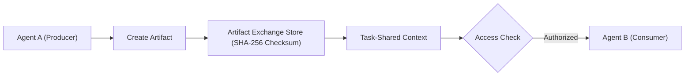

# Cross-Agent Artifact Exchange

**Status:** COMPLETE  

Agents exchange data using structured `Artifact` records rather than raw internal memory pointer sharing.

## Artifact Exchange Architecture



## Artifact Types

- `File`: Local filesystem file reference.
- `Text`: Text content snippet.
- `Json`: Structured JSON document.
- `Image` / `Screenshot`: Base64 encoded image data.
- `Table` / `Dataset`: Tabular data payload.
- `Report`: Formatted report document.
- `ApplicationState`: Serialized app window/process metadata.
- `BrowserResult`: Web page read payload.

## Artifact Structure

```rust
pub struct Artifact {
    pub artifact_id: String,
    pub owner_agent_id: String,
    pub task_id: String,
    pub artifact_type: ArtifactType,
    pub location: String,
    pub metadata: Value,
    pub permissions: Vec<String>,
    pub created_at: u64,
    pub checksum: String, // SHA-256
}
```
