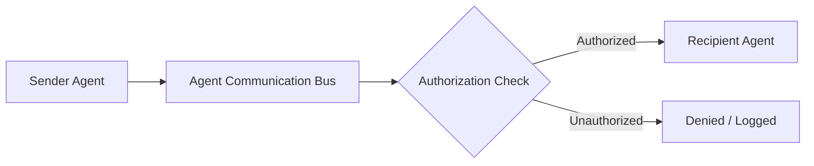

# Agent Communication Model

**Status:** COMPLETE  

Agents communicate exclusively through structured messages managed by the `AgentCommunicationBus`. Direct cross-agent internal memory access is strictly prohibited.

## Message Routing Architecture



## Authorized Communication Paths

Agents may ONLY communicate with:
1. **Parent Agent** (upward status/results/approval)
2. **Child Agents** (downward tasks/cancellation/requests)
3. **Explicitly Authorized Peer Agents** (cross-agent artifact sharing)
4. **Manager Agent**
5. **System Services**

Arbitrary, unrestricted agent-to-agent message broadcasting is forbidden.

## Message Types

- `TASK_ASSIGNMENT`: Assigns a node or subtask to a target agent.
- `TASK_RESULT`: Delivers execution output or artifact references.
- `INFORMATION_REQUEST`: Queries approved task-shared context.
- `INFORMATION_RESPONSE`: Returns queried information.
- `CAPABILITY_REQUEST`: Requests additional capability grant from parent/system.
- `STATUS_UPDATE`: Reports lifecycle state changes.
- `PROGRESS_UPDATE`: Reports percentage or node execution progress.
- `ERROR`: Reports error details.
- `APPROVAL_REQUEST`: Requests user/parent approval.
- `CANCEL`: Propagates cancellation signal down the tree.
- `PAUSE` / `RESUME`: Lifecycle control messages.
- `HEARTBEAT`: Periodic health signal for `AgentSupervisor`.

## Message Envelope Structure

```rust
pub struct AgentMessage {
    pub message_id: String,
    pub sender_agent_id: String,
    pub recipient_agent_id: String,
    pub task_id: String,
    pub timestamp: u64,
    pub message_type: AgentMessageType,
    pub payload: Value,
    pub authorization_context: Value,
    pub trace_id: String,
}
```
