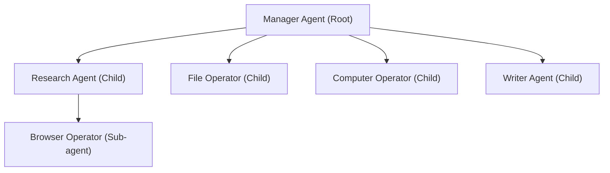

# Agent Hierarchy & Delegation

**Status:** COMPLETE  

The agent hierarchy structures child and sub-agent execution under a Manager Agent for complex user tasks.

## Hierarchy Tree

## Tree Constraints & Enforcement

To prevent infinite agent loops and resource exhaustion, `AgentManager` enforces strict tree bounds:

1. **Max Tree Depth**: Default = `4` (Root = depth 0, Child = depth 1, Sub-agent = depth 2, etc.). Spawning beyond max depth returns an error.
2. **Max Children Per Parent**: Default = `8` children.
3. **Max Active Agents Per Root Task**: Default = `32` total active agents.

## Parent-Child Properties

Every child agent maintains:
- `parent_agent_id`: Parent's globally unique agent ID.
- `root_agent_id`: Root task manager agent ID.
- `task_id`: Associated task identifier.
- `permissions`: Scoped subset of parent permissions.
- `resource_limits`: Sub-allocated quota from parent resource budget.
- `capabilities`: Scoped capability list.

## Tree Traversal API

`AgentRegistry` provides methods:
- `get_children(parent_id: &str) -> Vec<Arc<AgentIdentity>>`
- `get_tree(root_id: &str) -> AgentTree`
- `get_descendants(root_id: &str) -> Vec<Arc<AgentIdentity>>`
