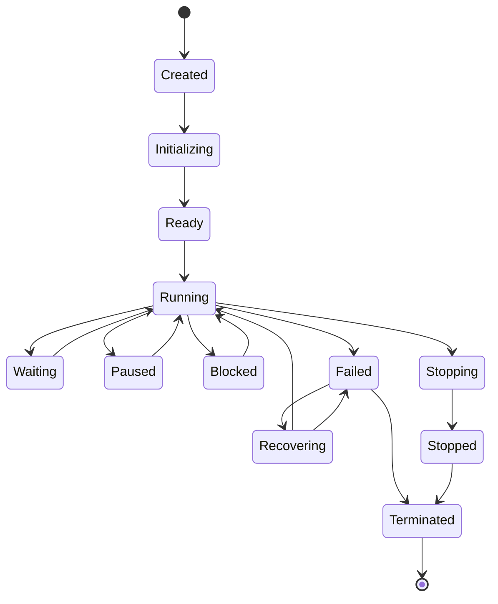

# Agent Lifecycle Management

**Status:** COMPLETE  

The `AgentLifecycleManager` maintains state transitions and records event streams for all active agents.

## State Machine

## Lifecycle States

- **`Created`**: Identity created, registered in `AgentRegistry`.
- **`Initializing`**: Setting up capability scope, context, policies.
- **`Ready`**: Prepared to accept task assignments.
- **`Running`**: Currently executing task nodes.
- **`Waiting`**: Awaiting message response, child task completion, or dependency node.
- **`Paused`**: Temporarily suspended by Manager or user.
- **`Blocked`**: Waiting on approval or resource quota lock.
- **`Failed`**: Execution error occurred.
- **`Recovering`**: `AgentSupervisor` attempting recovery (retry, restart, replace).
- **`Stopping`**: Graceful shutdown initiated.
- **`Stopped`**: Gracefully stopped.
- **`Terminated`**: Permanently shut down and resources reclaimed.

## Observability Events

Every state transition publishes structured events via `AgentEventPublisher`:
- `agent.created`
- `agent.started`
- `agent.ready`
- `agent.task_assigned`
- `agent.message_sent`
- `agent.message_received`
- `agent.capability_requested`
- `agent.capability_completed`
- `agent.waiting`
- `agent.paused`
- `agent.resumed`
- `agent.failed`
- `agent.recovering`
- `agent.replaced`
- `agent.stopped`
- `agent.terminated`
