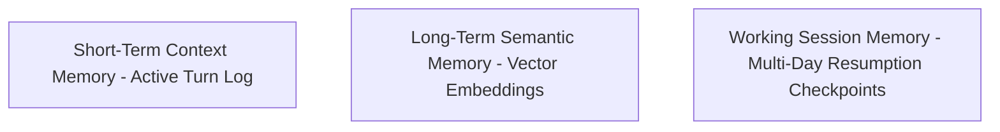

# CognyxOS Agent Memory Engine Architecture

> **Document ID:** ARCH-PHASE3-AGENT-MEMORY  
> **Version:** 1.0.0  

---

## 1. Memory Tier Hierarchy

## 2. Session Resumption Workflow
When a user asks to *"Continue what I was doing yesterday"*, `AgentMemoryEngine` queries working session state checkpoints and restores graph execution context seamlessly.
