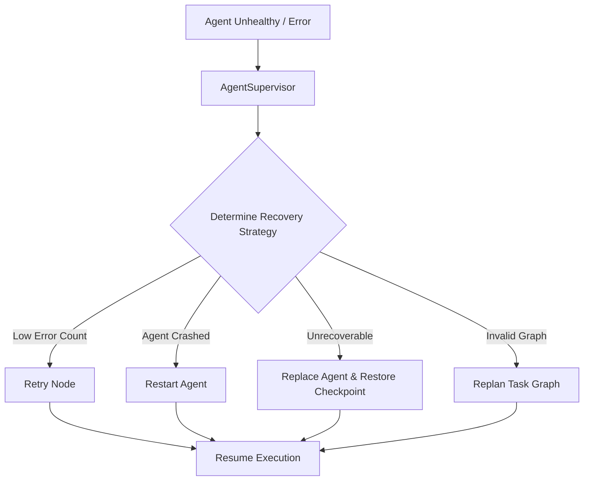

# Agent Supervision & Failure Recovery

**Status:** COMPLETE  

The `AgentSupervisor` monitors child agent health and manages automatic failure recovery using Phase 3 `RecoveryEngine` and `CheckpointEngine` primitives.

## Recovery Sequence

## Recovery Strategies

1. **`Retry`**: Re-attempts the failed node if `retry_count < max_retries`.
2. **`Restart`**: Re-initializes the agent from its last valid checkpoint without changing identity.
3. **`Replace`**: Spawns a clean replacement agent with identical role and scope, transfers approved task-shared context, and terminates the failed agent.
4. **`Replan`**: Signals `MultiAgentPlanner` to restructure the execution graph when a dependency node is permanently unavailable.

## Checkpoint Persistence

Agent checkpoints capture:
- Agent lifecycle state & identity
- Active task assignment & current node index
- Message history & trace state
- Approved shared task context & artifact references
- Granted permission scope & resource state
