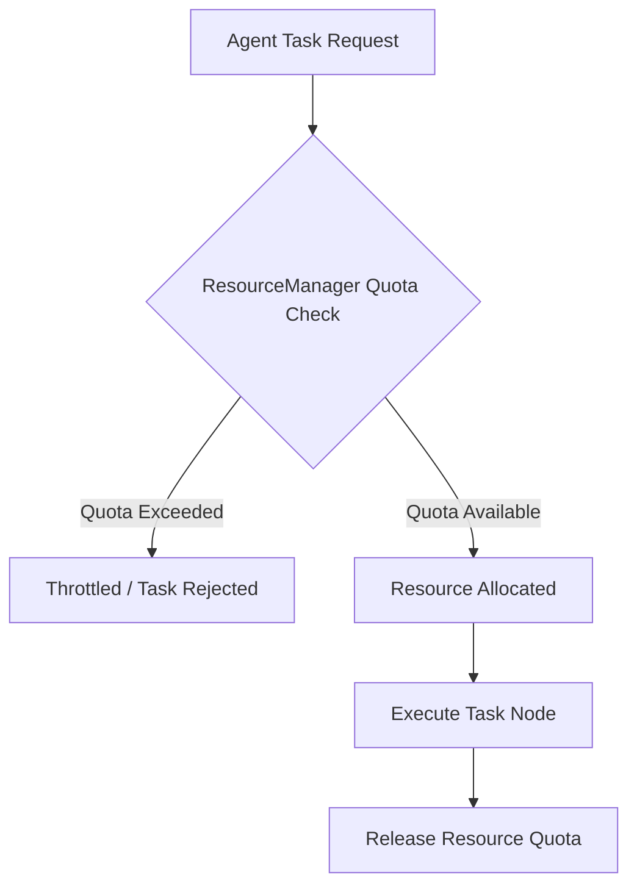

# Agent Resource Limits & Quotas

**Status:** COMPLETE  

The Multi-Agent Runtime integrates directly with the Phase 2 `ResourceManager` to enforce resource quotas per agent identity.

## Quota Model

Each agent has an `AgentResourceLimits` configuration:

```rust
pub struct AgentResourceLimits {
    pub cpu_quota_pct: f32,
    pub memory_bytes: u64,
    pub max_child_agents: usize,
    pub max_concurrent_tasks: usize,
    pub max_retries: u32,
    pub max_message_rate: u32,
    pub timeout_seconds: u32,
}
```

## Resource Allocation Flow



## Enforcement Mechanics

- **CPU & Memory**: Allocated via `ResourceManager::request_allocation`. If host capacity is insufficient, task node scheduling is delayed.
- **Message Rate**: `AgentCommunicationBus` rate limits message bursts per agent ID.
- **Tree Depth & Children**: `AgentManager` rejects `spawn_child_agent` calls if depth > 4 or children > 8.
