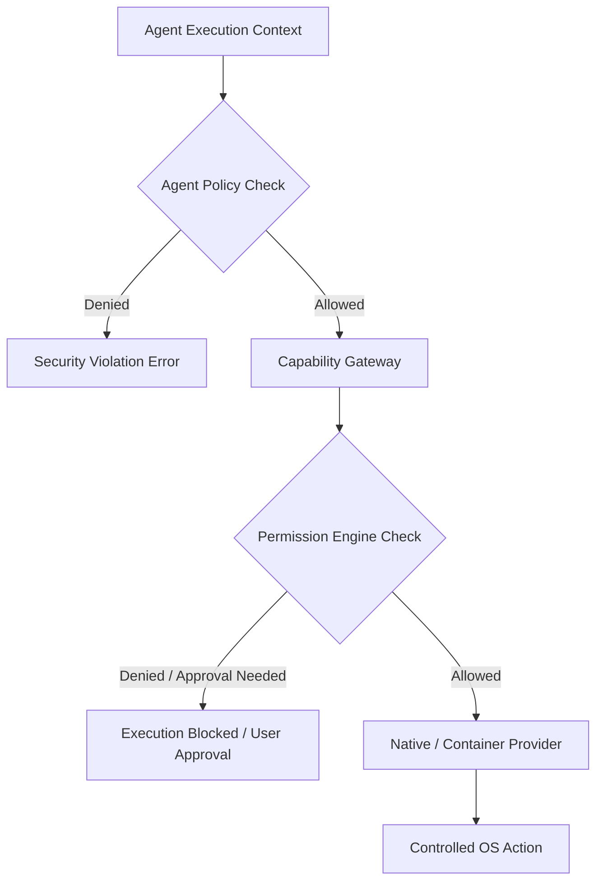

# Agent Security Architecture

**Status:** COMPLETE  

The Multi-Agent Runtime strictly enforces security boundaries. An agent is a **controlled execution identity**, not an independent process with unrestricted capabilities.

## Security Boundary Matrix

## Non-Negotiable Security Invariants

1. **No Direct Host Access**: Agents cannot bypass the `CapabilityGateway`. Direct Win32, Cocoa, or Linux syscall manipulation by an agent is impossible.
2. **No Memory Contamination**: Agents cannot inspect or modify another agent's private working memory.
3. **No Privilege Escalation**: A child agent can NEVER possess capabilities or permissions that its parent does not have (`evaluate_permission_inheritance`).
4. **No Simulated Fallbacks**: If a capability cannot be natively executed by a real provider on the host runtime, `CAPABILITY_UNAVAILABLE` is returned. Fake success is forbidden.
5. **No Unaudited Actions**: All capability requests, message dispatches, and permission evaluations emit trace events to the central audit stream.
6. **No Unlimited Spawning**: Spawning limits prevent fork bombs (depth limit = 4, max children = 8, max total = 32).
