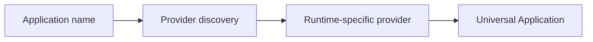

# Application model

The universal `Application` model contains application id, names, version, runtime id, executable, capabilities, permissions, status, and metadata. Application discovery/open/focus providers are presently contract adapters, not hardware-verified native integrations.

