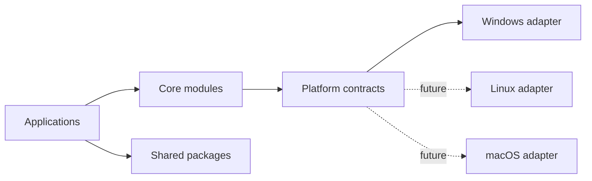

# Architecture

## Dependency direction

Applications depend on packages and core contracts. Core modules may depend on shared contracts, but never on an operating system directly. Platform adapters implement those contracts.

Python uses explicit constructor injection through `Container`. TypeScript uses interfaces and composition roots. Modules must not instantiate infrastructure dependencies internally.

The plugin framework discovers `cognyx.plugins` entry points, validates API version and dependencies during registration, and supports lifecycle loading and unloading. No plugin is shipped in this phase.
