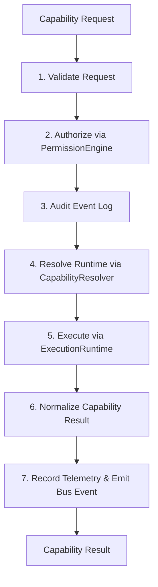

# CognyxOS Capability Gateway Architecture

> **Document ID:** ARCH-PHASE3-CAPABILITY-GATEWAY  
> **Version:** 1.0.0  

---

## 1. 7-Step Capability Execution Pipeline

```mermaid
graph TD
    Req[Capability Request] --> Step1[1. Validate Request]
    Step1 --> Step2[2. Authorize via PermissionEngine]
    Step2 --> Step3[3. Audit Event Log]
    Step3 --> Step4[4. Resolve Runtime via CapabilityResolver]
    Step4 --> Step5[5. Execute via ExecutionRuntime]
    Step5 --> Step6[6. Normalize Capability Result]
    Step6 --> Step7[7. Record Telemetry & Emit Bus Event]
    Step7 --> Res[Capability Result]
```
