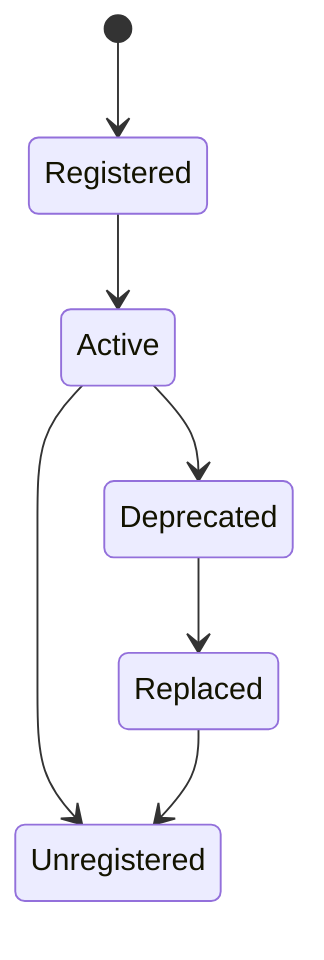

# Capability versioning

Capabilities use `v<major>.<minor>`. A provider can satisfy a request only when the major version matches and its minor version is at least the requested version. Definitions may be marked deprecated; replacement providers can register a newer compatible version before the old one is removed.

