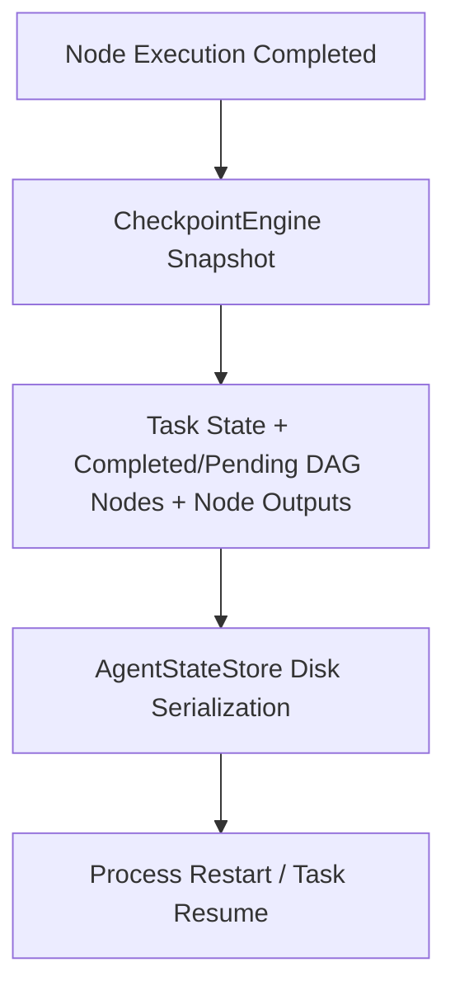

# CognyxOS Task Checkpointing Architecture

> **Document ID:** ARCH-PHASE3-CHECKPOINTING  
> **Version:** 1.0.0  

---

## 1. Checkpoint Flow

```mermaid
graph TD
    NodeDone[Node Execution Completed] --> Snap[CheckpointEngine Snapshot]
    Snap --> State[Task State + Completed/Pending DAG Nodes + Node Outputs]
    State --> Disk[AgentStateStore Disk Serialization]
    Disk --> Resume[Process Restart / Task Resume]
```
