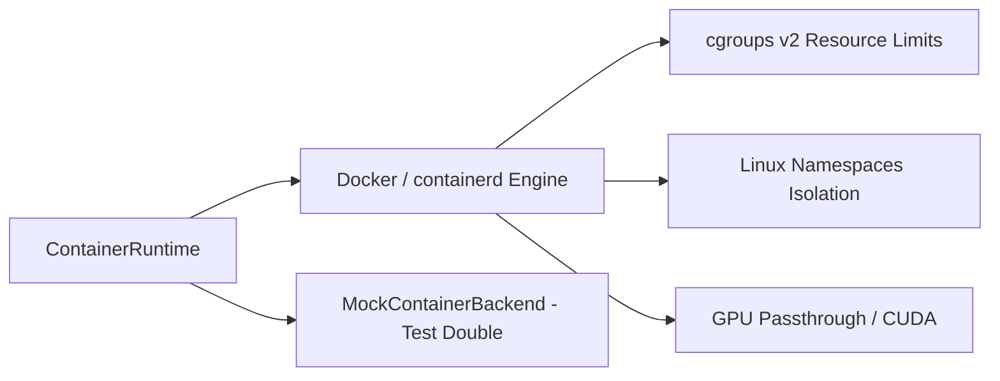

# CognyxOS Container Runtime Architecture

> **Document ID:** ARCH-PHASE2-CONTAINER  
> **Version:** 1.0.0  

---

## 1. Container Lifecycle & Isolation

## 2. Supported APIs
- `create`, `start`, `stop`, `restart`, `pause`, `resume`, `delete`, `exec`, `logs`, `inspect`, `metrics`.
