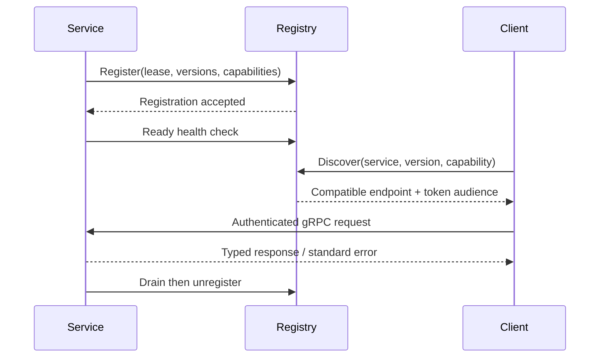

# IPC and service registry

## IPC decision

| Approach                  | Strength                                        | Limitation                       | Decision                      |
| ------------------------- | ----------------------------------------------- | -------------------------------- | ----------------------------- |
| gRPC over local transport | typed, streaming, code generation, cancellation | requires local transport adapter | **primary service protocol**  |
| Durable event bus         | decoupled, replayable facts                     | not request/response             | **event distribution**        |
| Named pipes / UDS         | secure, efficient local transport               | OS-specific                      | gRPC transport implementation |
| WebSockets                | useful for browser clients                      | weaker local service contract    | external gateway only         |
| Shared memory             | high throughput                                 | difficult ownership/security     | prohibited without ADR        |

Services use gRPC/protobuf semantically over authenticated local named pipes on Windows and Unix domain sockets on Linux/macOS. TCP is disabled by default; if enabled it requires mTLS and an explicit configuration policy. The platform adapter owns endpoint construction.

## Protocol

Every request has the common envelope plus `request_id`, `service`, `method`, `deadline_ms`, and typed `body`. Responses include the original `request_id`, `status`, typed `body` or a standard error. Unary and server-streaming calls are permitted. Streams include monotonically increasing `sequence`, explicit cancellation, and terminal status. Clients default to a 30-second deadline; services MUST publish stricter method timeouts. Retries apply only to idempotent methods and require a retry token.

Authentication is a local, short-lived capability token minted by the permission broker and bound to process identity, session, audience, and scope. Service discovery resolves logical names through the local registry; no caller hard-codes an endpoint.

## Registry

A service registers `{service_id, instance_id, contract_versions, capabilities, endpoint, health, dependencies}` with a lease. It must renew before expiry. Discovery filters by service ID, required capability, compatible major contract version, and health. Version negotiation selects the highest mutually supported minor version within a shared major; otherwise discovery fails with `VERSION_INCOMPATIBLE`.

Services move through `registered → starting → healthy → draining → stopped` or `unhealthy`. Health checks are liveness and readiness probes with timeout; dependency health gates readiness. A supervisor owns restart policy and shutdown ordering. Registry records are local only and never expose credentials.

## Errors

Transport errors use the standard error envelope: `code`, `category`, `retryable`, `message`, `details`, and correlation metadata. Sensitive details are logged locally but are not sent to unauthorized clients. Deadline expiration is `DEADLINE_EXCEEDED`; auth failures are `UNAUTHENTICATED` or `PERMISSION_DENIED`.
