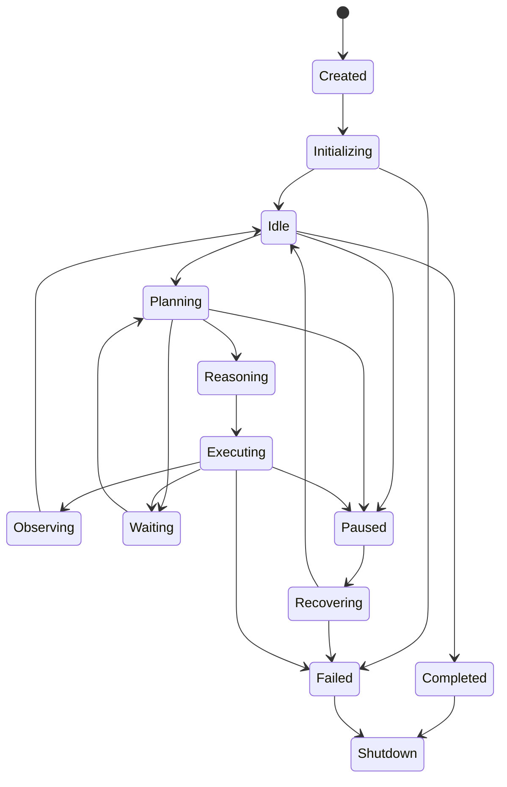

# Agent lifecycle and task graph

## Agent lifecycle

States are `Created`, `Initializing`, `Idle`, `Planning`, `Waiting`, `Executing`, `Observing`, `Reasoning`, `Paused`, `Recovering`, `Completed`, `Failed`, and `Shutdown`. Terminal states are `Completed`, `Failed`, and `Shutdown`. `Paused` preserves a checkpoint; `Recovering` restores one after host failure.

Only the lifecycle coordinator transitions state. Every transition has a reason, timestamp, correlation ID, and durable checkpoint boundary. Cancellation from non-terminal state enters `Paused` or `Shutdown` after compensation; it never silently becomes `Completed`.

## Task graph

A goal produces a versioned directed acyclic task graph: `Goal → Planner → graph → dependency resolution → scheduler → execution → verification → completion`. A task node contains immutable `task_id`, kind, input/output schema refs, capability requirements, priority, deadline, retry policy, cancellation policy, rollback strategy, dependencies, and state. Edges are `requires`, `blocks`, or `compensates`.

Nodes move `pending → ready → running → verifying → completed` or `retrying|failed|cancelled|rolled_back`. The scheduler runs only ready nodes, respects dependency and resource constraints, and may run independent nodes in parallel. Priorities are `critical|high|normal|low`; starvation prevention ages waiting tasks. Retry requires an idempotency key and explicit retryable error set. Timeouts cancel the invocation, then apply recovery/rollback policy. A failed node blocks downstream `requires` edges; compensating nodes run in reverse dependency order. Recovery rebuilds state from durable task transitions and event-log cursors.
