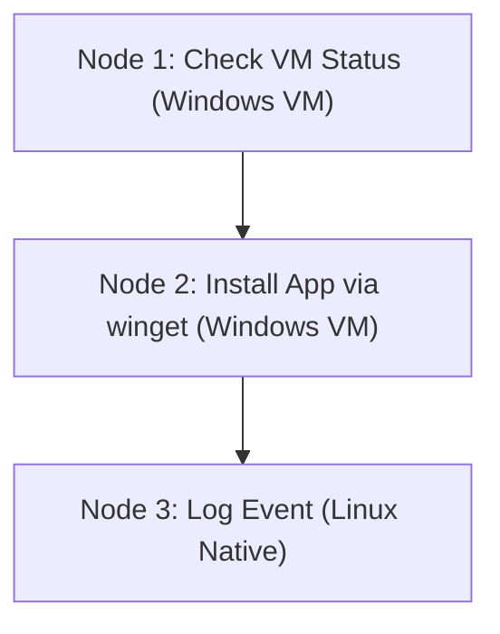

# CognyxOS Execution Graph Architecture

> **Document ID:** ARCH-PHASE3-EXECUTION-GRAPH  
> **Version:** 1.0.0  

---

## 1. DAG Execution Node Model

## 2. Dependency Resolution
`GraphScheduler` evaluates node readiness dynamically as parent node dependency IDs report successful execution completion.
