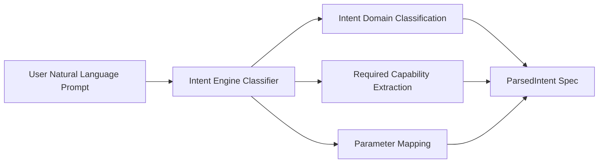

# CognyxOS Intent Engine Specification

> **Document ID:** ARCH-PHASE3-INTENT  
> **Version:** 1.0.0  

---

## 1. Intent Parsing Model

## 2. Supported Intent Domains
- `AppInstallation`
- `DocumentGeneration`
- `DataAnalysis`
- `SessionResume`
- `SystemOperation`
- `ApplicationExecution`
- `FileManagement`
