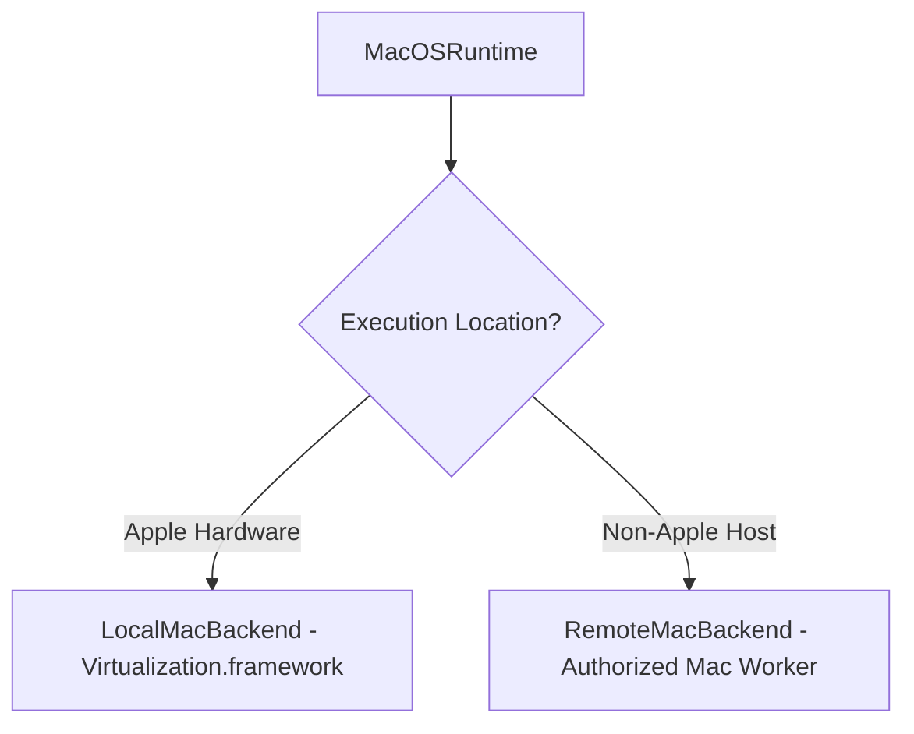

# CognyxOS macOS Runtime Architecture & Licensing Model

> **Document ID:** ARCH-PHASE2-MACOS  
> **Version:** 1.0.0  

---

## 1. Compliance Architecture

## 2. Abstraction Strategy
The capability interface `ExecutionRuntime` remains identical whether using `LocalMacBackend` or `RemoteMacBackend`, ensuring full Apple EULA compliance without restricting multi-OS workflow automation.
