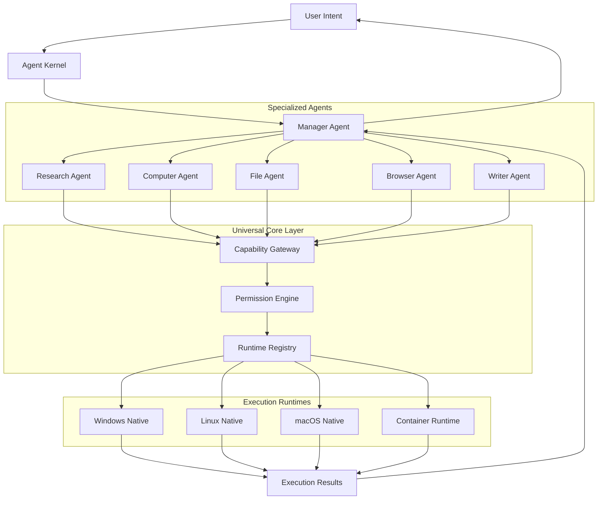

# Multi-Agent Runtime

**Status:** COMPLETE  

The Multi-Agent Runtime operates **ABOVE** the existing Agent Kernel, orchestrating multiple specialized agents working together on complex user objectives.

## Target Architecture



## Agent Identity

Every agent has a globally unique UUID v7 identifier and an `AgentIdentity` record:

```rust
pub struct AgentIdentity {
    pub agent_id: String,
    pub parent_agent_id: Option<String>,
    pub root_agent_id: String,
    pub name: String,
    pub display_name: String,
    pub role: AgentRole,
    pub status: AgentLifecycleState,
    pub created_at: u64,
    pub started_at: Option<u64>,
    pub stopped_at: Option<u64>,
    pub permissions: Vec<String>,
    pub capabilities: Vec<String>,
    pub resource_limits: AgentResourceLimits,
    pub metadata: Value,
}
```

## Agent Roles

Initial roles defined by `AgentRole`:

1. `MANAGER`: Orchestrates task decomposition, delegates work to child agents, aggregates results.
2. `PLANNER`: Analyzes intents and constructs multi-agent execution graphs.
3. `RESEARCHER`: Information gathering (`browser.read`, `filesystem.read`, `network.request`).
4. `COMPUTER_OPERATOR`: Native OS control (`application.open`, `screen.capture`, `keyboard.type`, `mouse.click`).
5. `FILE_OPERATOR`: Filesystem operations (`filesystem.read/write/list`).
6. `BROWSER_OPERATOR`: Web navigation (`browser.open/navigate/read/click/type/screenshot`).
7. `ANALYST`: Data processing and validation.
8. `WRITER`: Report and document generation.
9. `VALIDATOR`: Quality assurance and plan validation.
10. `WORKER`: Generic capability worker.
11. `CUSTOM(String)`: Extensible role capability for future custom agents.
