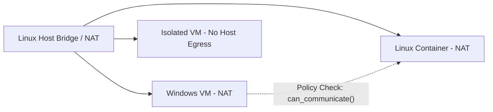

# CognyxOS Virtual Networking Architecture

> **Document ID:** ARCH-PHASE2-NETWORKING  
> **Version:** 1.0.0  

---

## 1. Network Modes & Inter-Runtime Firewall

## 2. Policy Decision Protocol
`VirtualNetworkManager::can_communicate(source_id, target_id, port, protocol)` evaluates firewall rules before allowing network packets across runtimes.
