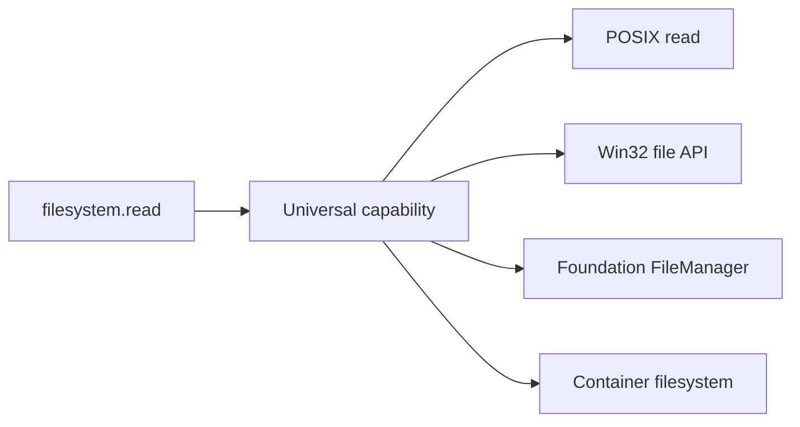

# OS adapters

`LinuxCapabilityAdapter`, `WindowsCapabilityAdapter`, `MacOSCapabilityAdapter`, and `ContainerCapabilityAdapter` translate universal names to native API concepts. They are only usable through an `AdapterProvider` registered with the universal layer.

Adapter responses are explicitly marked `simulated: true` until a native transport is configured and tested on that target OS.
