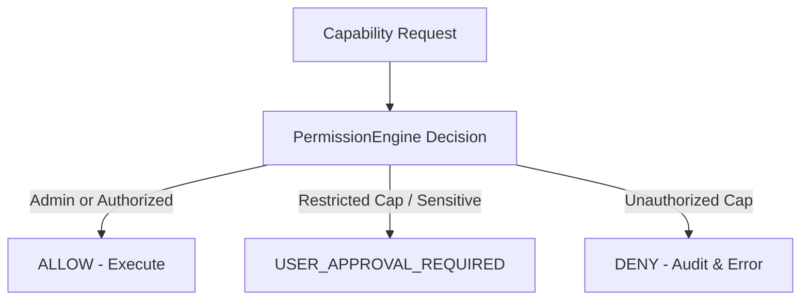

# CognyxOS Capability Permissions & Authorization Security Model

> **Document ID:** ARCH-PHASE3-PERMISSIONS  
> **Version:** 1.0.0  

---

## 1. Permission Flow Diagram

## 2. Decision Matrix
- `ALLOW`: Permitted automatically.
- `DENY`: Rejected with security audit log.
- `USER_APPROVAL_REQUIRED`: Prompt user before proceeding.
