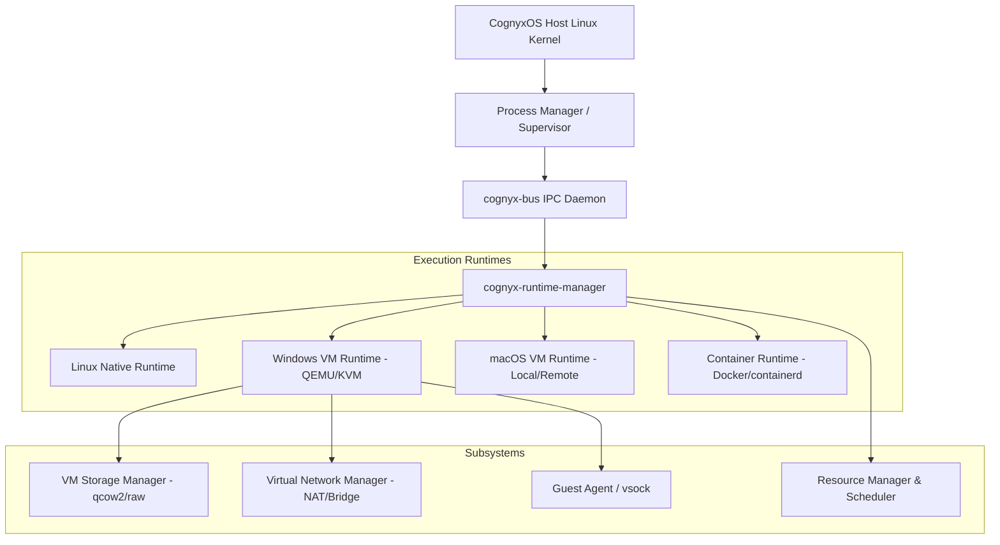

# CognyxOS Phase 2 Architecture & Execution Overview

> **Document ID:** ARCH-PHASE2-OVERVIEW  
> **Version:** 1.0.0  
> **Status:** Implemented  

---

## 1. System Architecture Diagram

## 2. Core Components & Responsibilities
- **Virtualization Abstraction (`cognyx-virtualization`):** Platform-independent interface (`VirtualMachineManager`, `VirtualMachineConfig`, `VirtualMachineSnapshot`) supporting production `KvmBackend` and test `MockBackend`.
- **Unified Runtime Interface (`cognyx-execution`):** Common `ExecutionRuntime` trait enabling capability discovery (`can_perform(capability)`).
- **Multi-OS Support:** Native Linux, Windows VM, macOS VM (Apple compliance/remote worker), Container execution.
- **Resource Management:** Real-time quota enforcement & reservation tracking.
