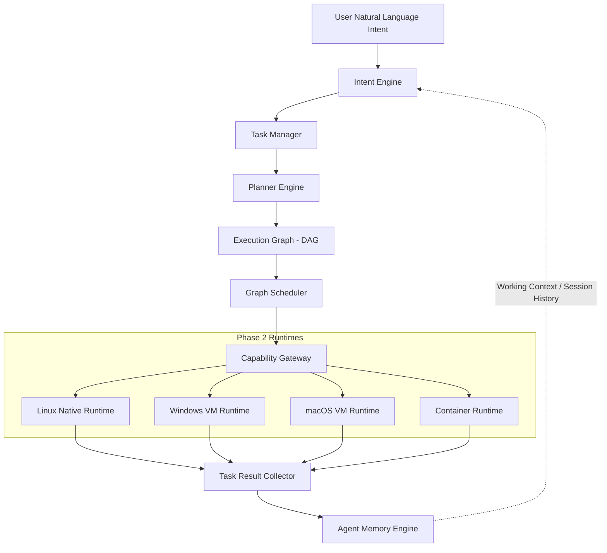

# CognyxOS Phase 3: Agent Kernel Architectural Analysis & Integration Mapping

> **Document ID:** ARCH-PHASE3-ANALYSIS  
> **Author:** Principal Systems Architect & Lead Systems Engineer  
> **Status:** Approved / Implementation Draft  

---

## 1. Executive Summary

Phase 3 introduces the **Agent Kernel**, the AI-native orchestration engine of CognyxOS.
While Phase 1 established host system services (IPC Bus, Process Supervision, Identity, Security) and Phase 2 established multi-OS execution runtimes (Native Linux, Windows VM, macOS VM abstraction, Containers, Virtual Storage, Virtual Networking), Phase 3 translates user intent into autonomous execution graphs.

The Agent Kernel acts as the central OS abstraction for human intent without directly mutating operating system APIs; instead, it delegates all tasks through Phase 2's `RuntimeRegistry` and Phase 1's `CapabilityToken` gateway.

---

## 2. Target Architecture & Pipeline

---

## 3. Core Modules & Responsibilities

### 3.1 Intent Engine (`runtime/agent/intent`)
- Converts free-form natural language prompts into structured `ParsedIntent` specifications.
- Identifies target domains (`AppInstallation`, `DocumentGeneration`, `DataAnalysis`, `SessionResume`, `SystemOperation`).
- Extracts required capabilities and parameter constraints.

### 3.2 Task Manager (`runtime/agent/task_manager`)
- Manages high-level `AgentTask` lifecycles (`Created`, `Planning`, `Executing`, `Paused`, `Completed`, `Failed`).
- Maintains task execution history and correlates sub-tasks to parent user sessions.

### 3.3 Planner & Execution Graph (`runtime/agent/planner`)
- Compiles structured intents into a Directed Acyclic Graph (`ExecutionGraph`).
- Each node (`ExecutionNode`) contains:
  - Required execution environment (`Linux`, `WindowsVM`, `MacOsVM`, `Container`)
  - Command / Action payload
  - Preconditions and verification assertions
  - Dependency edge references

### 3.4 Graph Scheduler (`runtime/agent/scheduler`)
- Evaluates `ExecutionGraph` readiness based on dependency resolution.
- Checks Phase 2 `ResourceManager` quotas before node dispatch.

### 3.5 Capability Gateway (`runtime/agent/gateway`)
- Intercepts graph node execution requests.
- Validates security permissions against Phase 1 `CapabilityToken`.
- Selects the target Phase 2 runtime from `RuntimeRegistry` and dispatches execution.

### 3.6 Agent Memory Engine (`runtime/agent/memory`)
- Maintains context across user interactions:
  - **Short-Term Memory:** Active session scratchpad & message log.
  - **Long-Term Memory:** Vector embeddings for semantic search over user files and past interactions.
  - **Working Context Memory:** State checkpointing for multi-day task resumption ("Continue what I was doing yesterday").

### 3.7 Agent Kernel Daemon (`runtime/agent/kernel`)
- Main service binary (`cognyx-agent-kernel`) bridging the `AgentKernelService` gRPC interface with internal engine components.

---

## 4. Integration Verification Plan
- Unit tests for Intent parsing, Graph compilation, Dependency scheduling, Gateway dispatching, and Memory query/store.
- Workspace validation using `cargo check --workspace` and `cargo test --workspace`.
