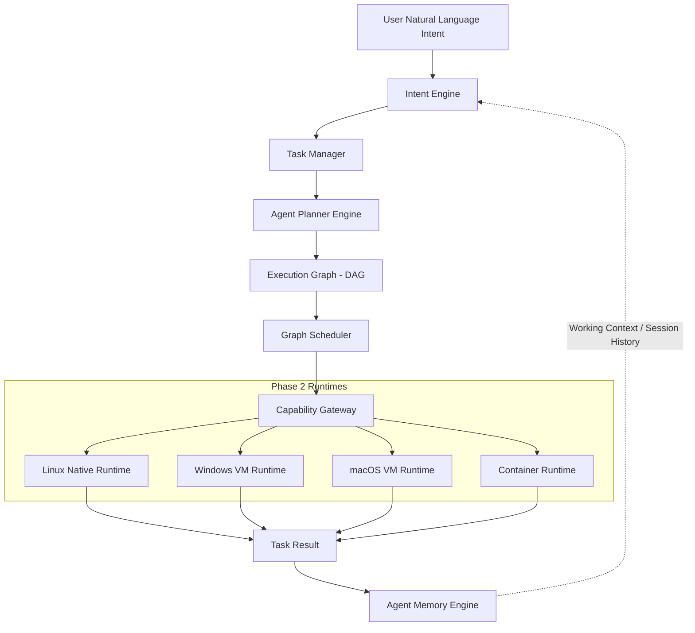

# CognyxOS Phase 3: Agent Kernel Architecture & Intent Orchestration

> **Document ID:** ARCH-PHASE3-OVERVIEW  
> **Version:** 1.0.0  
> **Status:** Implemented  

---

## 1. System Architecture Diagram

## 2. Core Principles
- CognyxOS is an AI-native operating system.
- The Agent Kernel is the primary user-intent abstraction interface.
- Conversational user intents ("Create a presentation", "Install Photoshop", "Continue yesterday's work") are compiled into executable Directed Acyclic Graphs (`ExecutionGraph`).
- The Agent Kernel does not directly manipulate OS-specific APIs; all commands pass through the Phase 2 `RuntimeRegistry` and Phase 1 `CapabilityToken` gateway.
