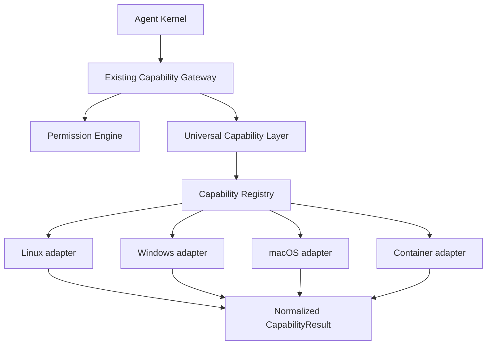
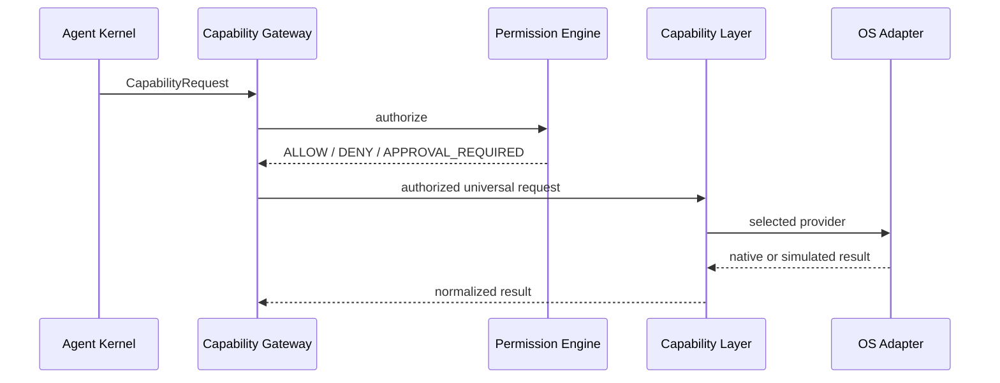

# Phase 4: Universal Capability Layer

Phase 4 introduces `cognyx-capability`, a runtime-neutral execution boundary below the existing Capability Gateway. Phase 1–3 interfaces remain unchanged: the gateway still authorizes requests, RuntimeRegistry remains the runtime source of truth, and the Agent Kernel never selects an OS adapter.

Provider resolution uses a compatible capability version, runtime hint, health state, and provider priority. The gateway only uses the universal layer for registered Phase 4 names; legacy Phase 1–3 capability handling remains frozen.

See the focused documents in this directory for contracts, providers, security, and versioning.
