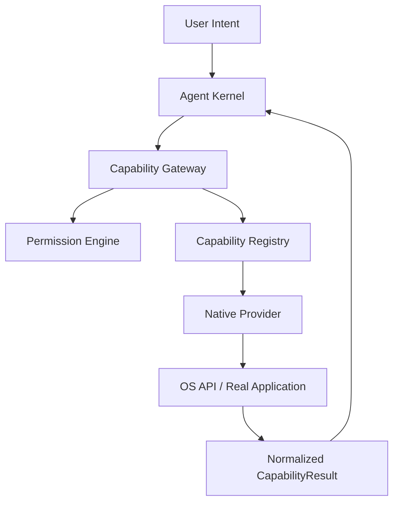

# Phase 5: Native OS Computer Control

**Status:** Partially Complete (Windows REAL, Linux/macOS STUB)
**Last Updated:** 2026-08-13

## Architecture

Phase 5 implements real native OS computer-control providers through the
universal capability layer. The Agent Kernel contains zero OS-specific logic.

## Provider Status Matrix

### Core Host Providers (All Platforms)
| Capability | Provider | Status | Hardware Tested |
|---|---|---|---|
| filesystem.read/write/list/delete/copy/move | LocalFilesystemProvider | REAL | YES (Windows) |
| application.list/search/inspect/open | NativeApplicationProvider | REAL | YES (Windows) |
| process.list/inspect/stop | NativeProcessProvider | REAL | YES (Windows) |
| terminal.execute (allowlisted) | NativeTerminalProvider | REAL | YES (Windows) |

### Windows Providers (Phase 5A)
| Capability | Provider | Status | Hardware Tested |
|---|---|---|---|
| clipboard.read/write | WindowsClipboardProvider | REAL | NOT-YET |
| screen.capture | WindowsScreenCaptureProvider | REAL | NOT-YET |
| window.list/inspect/focus/close/minimize/maximize/move/resize | WindowsWindowProvider | REAL | NOT-YET |
| keyboard.type/press/hotkey | WindowsKeyboardProvider | REAL | NOT-YET |
| mouse.move/click/double_click/right_click/scroll | WindowsMouseProvider | REAL | NOT-YET |
| screen.read | WindowsScreenReadProvider | UNAVAILABLE (UIA fallback planned) | N/A |

### Universal Browser Provider (Phase 5B)
| Capability | Provider | Status | Hardware Tested |
|---|---|---|---|
| browser.open/close/navigate/read/click/type/screenshot/tabs | UniversalBrowserProvider | REAL (requires Playwright) | NOT-YET |
| browser.download/upload | — | UNAVAILABLE (security review pending) | N/A |

### Linux Providers (Phase 5C)
| Capability | Provider | Status | Hardware Tested |
|---|---|---|---|
| All Linux capabilities | LinuxProviders | STUB (architecture only) | NO (Windows dev environment) |

### macOS Providers (Phase 5D)
| Capability | Provider | Status | Hardware Tested |
|---|---|---|---|
| All macOS capabilities | MacOSProviders | STUB (architecture only) | NO (no Mac available) |

## Security Properties

- No simulated provider success: if a capability cannot execute, CAPABILITY_UNAVAILABLE is returned
- Every capability passes through PermissionEngine before provider execution
- Sensitive operations require granted_capabilities in PermissionContext
- USER_APPROVAL_REQUIRED blocks provider execution entirely
- All capability executions are audited

## Phase 5 Completion Criteria

- [x] No production simulated-provider fallbacks
- [x] CAPABILITY_UNAVAILABLE for unregistered capabilities
- [x] Permission enforcement (USER_APPROVAL_REQUIRED blocks execution)
- [x] Windows application/process/filesystem/terminal real providers
- [ ] Windows screen.capture hardware tested
- [ ] Windows keyboard/mouse hardware tested
- [ ] Windows window control hardware tested
- [ ] Browser automation integration tested
- [ ] E2E: Open app + type text demonstrated
