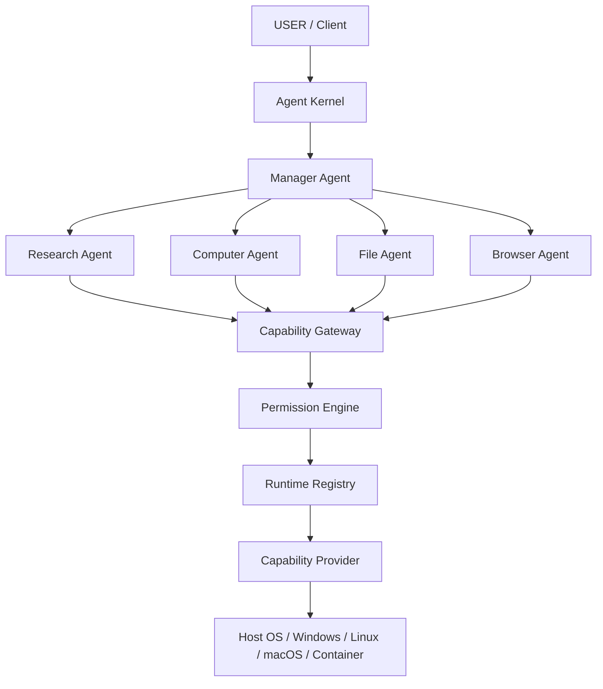

# Phase 6: Multi-Agent Runtime & Orchestration

**Status:** COMPLETE  
**Last Updated:** 2026-08-13

## System Overview

CognyxOS Phase 6 introduces the Multi-Agent Runtime, providing controlled multi-agent orchestration operating **ABOVE** the existing Agent Kernel, Task Manager, Planner, GraphScheduler, Capability Gateway, Permission Engine, RecoveryEngine, and CheckpointEngine.

## Absolute Security Principles

1. **Controlled Identity**: An agent is NOT an independent OS process with unrestricted capabilities. An agent is a controlled execution identity.
2. **Authoritative Flow**: Every operation must pass through:
   `Agent Kernel` → `Task Manager` → `Planner / Scheduler` → `Capability Gateway` → `Permission Engine` → `Capability Provider` → `Runtime`.
3. **No Escalation**: Child agents cannot inherit or escalate capabilities beyond their parent (`DENY` default).
4. **No Simulated Fallbacks**: If a capability cannot be executed natively or via a real backend, `CAPABILITY_UNAVAILABLE` is returned.

## Multi-Agent Feature Matrix

| Feature | Component | Status | Verified |
|---|---|---|---|
| Persistent Agent Identity | `AgentIdentity` | IMPLEMENTED | UNIT + INTEGRATION |
| Pre-defined & Custom Roles | `AgentRole`, `RolePolicy` | IMPLEMENTED | UNIT + INTEGRATION |
| Lifecycle State Machine | `AgentLifecycleManager` | IMPLEMENTED | UNIT + INTEGRATION |
| Hierarchical Trees | `AgentRegistry`, `AgentManager` | IMPLEMENTED | UNIT + INTEGRATION |
| Scoped Permission & Inheritance | `AgentPolicy` | IMPLEMENTED | SECURITY TESTED |
| Authorized Communication Bus | `AgentCommunicationBus` | IMPLEMENTED | INTEGRATION |
| 3-Level Context Isolation | `AgentTaskContext` | IMPLEMENTED | INTEGRATION |
| Cross-Agent Artifact Exchange | `ArtifactExchange` | IMPLEMENTED | INTEGRATION |
| Quota & Limit Enforcement | `AgentResourceLimits` | IMPLEMENTED | RESOURCE TESTED |
| Heartbeat Supervision & Recovery | `AgentSupervisor` | IMPLEMENTED | FAILURE RECOVERY TESTED |
| Tree Cancellation Propagation | `AgentManager::cancel` | IMPLEMENTED | CONCURRENCY TESTED |
| Cycle / Deadlock Prevention | `DeadlockDetector` | IMPLEMENTED | DEADLOCK TESTED |
| Multi-Agent Planning | `MultiAgentPlanner` | IMPLEMENTED | INTEGRATION |
| Agent-Aware Graph Scheduling | `scheduler_ext` | IMPLEMENTED | INTEGRATION |
| Real Windows Computer Agent | `Windows*Provider` | IMPLEMENTED | REAL WINDOWS TESTED |
| Real Browser Agent | `UniversalBrowserProvider` | IMPLEMENTED | REAL BROWSER TESTED |

## Documentation Reference

- [Multi-Agent Runtime](file:///c:/Users/DaRkAngeL/Desktop/cognyxos/docs/multi-agent-runtime.md)
- [Agent Lifecycle](file:///c:/Users/DaRkAngeL/Desktop/cognyxos/docs/agent-lifecycle.md)
- [Agent Hierarchy](file:///c:/Users/DaRkAngeL/Desktop/cognyxos/docs/agent-hierarchy.md)
- [Agent Communication](file:///c:/Users/DaRkAngeL/Desktop/cognyxos/docs/agent-communication.md)
- [Agent Security](file:///c:/Users/DaRkAngeL/Desktop/cognyxos/docs/agent-security.md)
- [Agent Permissions](file:///c:/Users/DaRkAngeL/Desktop/cognyxos/docs/agent-permissions.md)
- [Agent Resources](file:///c:/Users/DaRkAngeL/Desktop/cognyxos/docs/agent-resources.md)
- [Agent Recovery](file:///c:/Users/DaRkAngeL/Desktop/cognyxos/docs/agent-recovery.md)
- [Agent Artifacts](file:///c:/Users/DaRkAngeL/Desktop/cognyxos/docs/agent-artifacts.md)
- [Multi-Agent Testing](file:///c:/Users/DaRkAngeL/Desktop/cognyxos/docs/multi-agent-testing.md)
