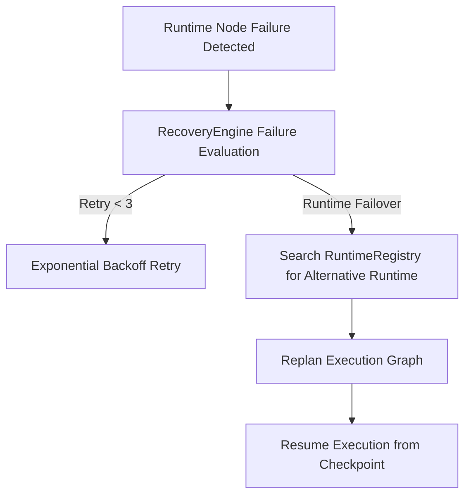

# CognyxOS Recovery & Dynamic Replanning Engine

> **Document ID:** ARCH-PHASE3-RECOVERY  
> **Version:** 1.0.0  

---

## 1. Dynamic Failover Flow Diagram

```mermaid
graph TD
    Fail[Runtime Node Failure Detected] --> Evaluate[RecoveryEngine Failure Evaluation]
    Evaluate -->|Retry < 3| Retry[Exponential Backoff Retry]
    Evaluate -->|Runtime Failover| Switch[Search RuntimeRegistry for Alternative Runtime]
    Switch --> Replan[Replan Execution Graph]
    Replan --> Resume[Resume Execution from Checkpoint]
```
