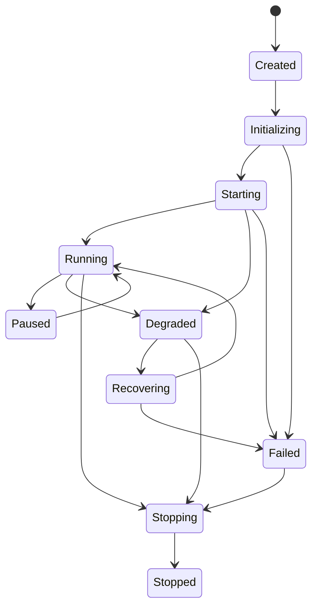

# Runtime lifecycle specification

| State          | Entry / exit                                             | Allowed transitions                   | Recovery and logging                             |
| -------------- | -------------------------------------------------------- | ------------------------------------- | ------------------------------------------------ |
| `Created`      | process allocated; exit after bootstrap begins           | Initializing, Failed                  | log boot ID                                      |
| `Initializing` | config and graph validation; exit when foundations ready | Starting, Failed                      | log validation failures                          |
| `Starting`     | services register in order; exit when ready checks pass  | Running, Degraded, Failed, Stopping   | log per-service timing                           |
| `Running`      | all required services ready                              | Paused, Degraded, Stopping, Failed    | periodic health/metrics                          |
| `Paused`       | admission closed, existing state retained                | Running, Stopping, Recovering         | log reason and checkpoint                        |
| `Degraded`     | optional/non-critical requirement unhealthy              | Running, Recovering, Stopping, Failed | emit health cause and impact                     |
| `Recovering`   | restore snapshot/cursors or retry recovery               | Running, Degraded, Failed, Stopping   | log recovery attempt/outcome                     |
| `Stopping`     | admission closed and draining                            | Stopped, Failed                       | log deadline and drain results                   |
| `Stopped`      | resources released                                       | Created                               | final audit record                               |
| `Failed`       | unrecoverable required component failure                 | Recovering, Stopping, Stopped         | critical structured error plus diagnostic bundle |

Every transition is serialized by the lifecycle coordinator and emits a structured lifecycle record. Direct state mutation by services is prohibited.
