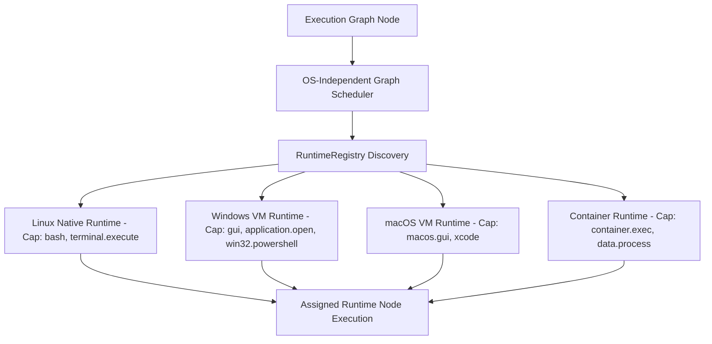

# CognyxOS OS-Independent Graph Scheduler

> **Document ID:** ARCH-PHASE3-SCHEDULER  
> **Version:** 1.0.0  

---

## 1. Runtime Selection Architecture

## 2. Scheduling Criteria
- Required capabilities matching
- Runtime health & availability
- Latency & task priority
- Resource quotas (`ResourceManager`)
- Security policy (`PermissionEngine`)
