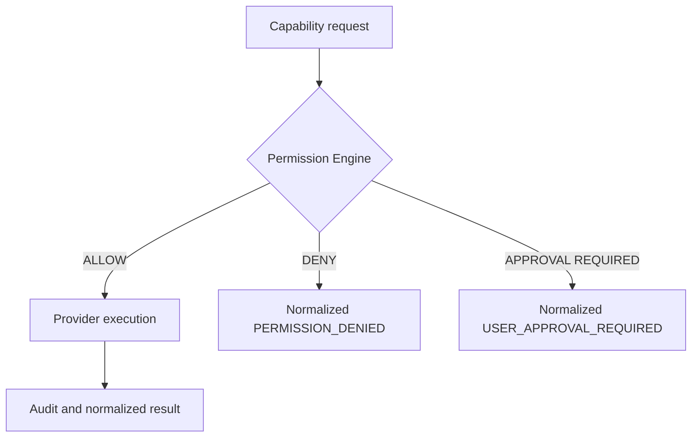

# Capability security

The existing Phase 3 `PermissionEngine` remains the authorization authority. The gateway rejects both `DENY` and `USER_APPROVAL_REQUIRED` requests before dispatch. Definitions expose permissions, resource needs, risk, security level, audit policy, and idempotency; audit events are emitted for registration, request, start, completion, failure, timeout, and provider health changes.

Phase 5 adds explicit approval requirements for destructive filesystem mutations, process start/stop, terminal execution, application close, and clipboard access. The native terminal provider only runs a configured executable allowlist and uses an argument vector—not a shell.

