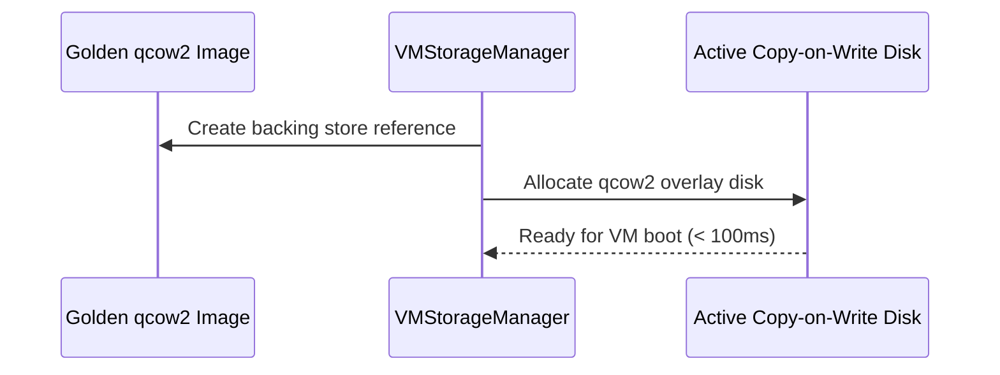

# CognyxOS VM Storage Architecture

> **Document ID:** ARCH-PHASE2-STORAGE  
> **Version:** 1.0.0  

---

## 1. Centralized Storage Layout
- `/var/lib/cognyxos/images`: Base OS installation ISOs and golden qcow2 templates.
- `/var/lib/cognyxos/disks`: Active qcow2/raw virtual disk drives.
- `/var/lib/cognyxos/snapshots`: Copy-on-Write (CoW) disk checkpoints.

## 2. CoW Cloning Workflow

