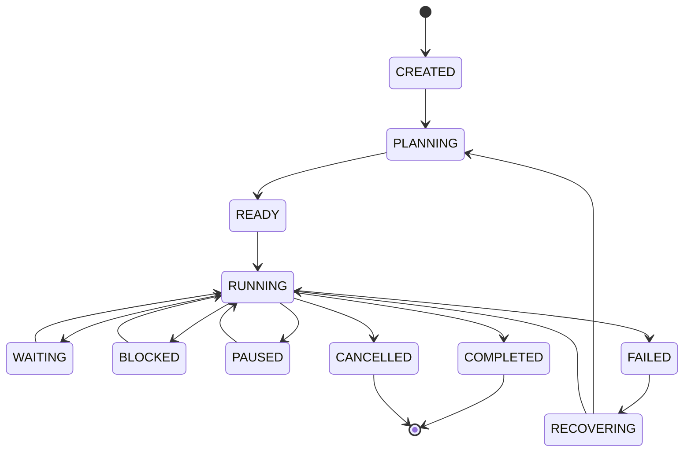

# CognyxOS Task Engine Architecture & Lifecycle

> **Document ID:** ARCH-PHASE3-TASK-ENGINE  
> **Version:** 1.0.0  

---

## 1. Task Lifecycle State Machine

## 2. Persistent Task Schema
Every task contains:
- `task_id`
- `intent_id`
- `parent_task_id`
- `status` (11 states)
- `priority`
- `constraints`
- `required_capabilities`
- `plan`
- `execution_graph`
- `assigned_runtime`
- `checkpoint`
- `result`
- `error`
- `timestamps`
- `retry_count`
