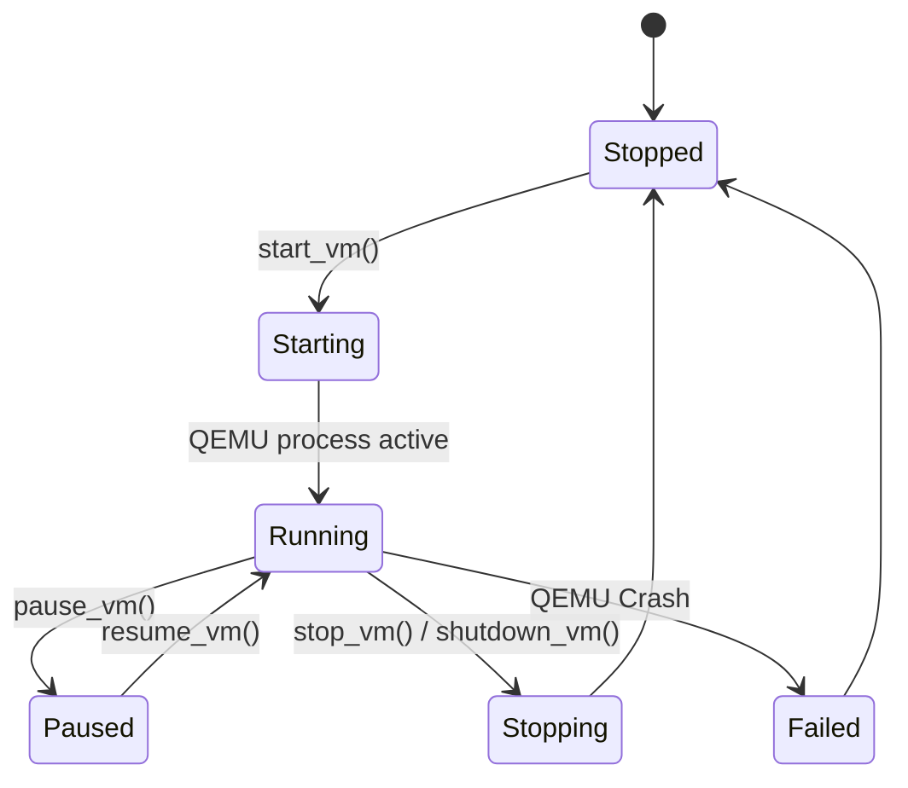

# CognyxOS Virtualization Abstraction & KVM Backend

> **Document ID:** ARCH-PHASE2-VIRTUALIZATION  
> **Version:** 1.0.0  

---

## 1. Virtual Machine Lifecycle

## 2. Abstraction Interface
- `VirtualMachineManager`: Platform-agnostic manager.
- `VirtualizationBackend`: Interface implemented by `KvmBackend` (QEMU/KVM with UEFI, TPM, VirtIO) and `MockBackend` (CI/test simulator).
