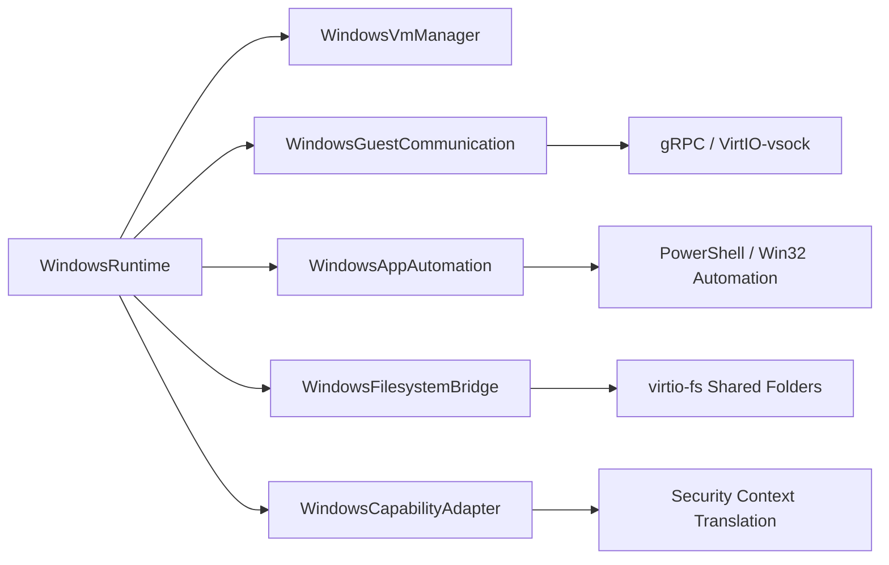

# CognyxOS Windows Execution Runtime Architecture

> **Document ID:** ARCH-PHASE2-WINDOWS  
> **Version:** 1.0.0  

---

## 1. Modular Windows Architecture

## 2. Capabilities
- `win32.powershell`: Execute PowerShell scripts inside guest.
- `win32.cmd`: Execute Command Prompt commands.
- `win32.filesystem`: Shared folder access via virtio-fs.
- `win32.automation`: Screen capture & UI automation.
